# kanbanr

A kanban-based task manager for **Claude-driven development**. You manage the board through a
Claude **skill** (which drives the `kanbanr` CLI), and a **read-only web monitor** shows what's
happening live as you work in VS Code.

## Screenshots

The web monitor is a **read-only** live view of your local data folder — the board updates over SSE
as the CLI (driven by Claude) changes things. No refresh, no login.

<p align="center">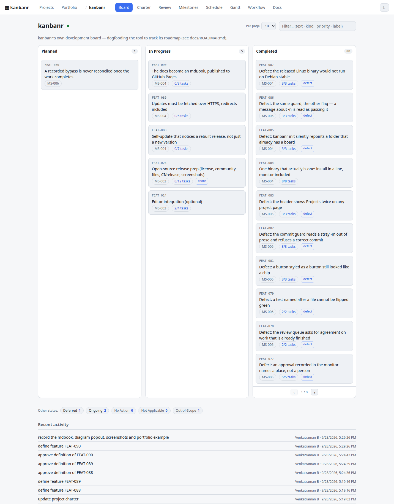</p>

A page per view — feature items (spec + persistent todo-lists), milestones, the derived schedule,
status pages, the off-board "Ongoing" stream, and per-project docs:

<table>
  <tr>
    <td>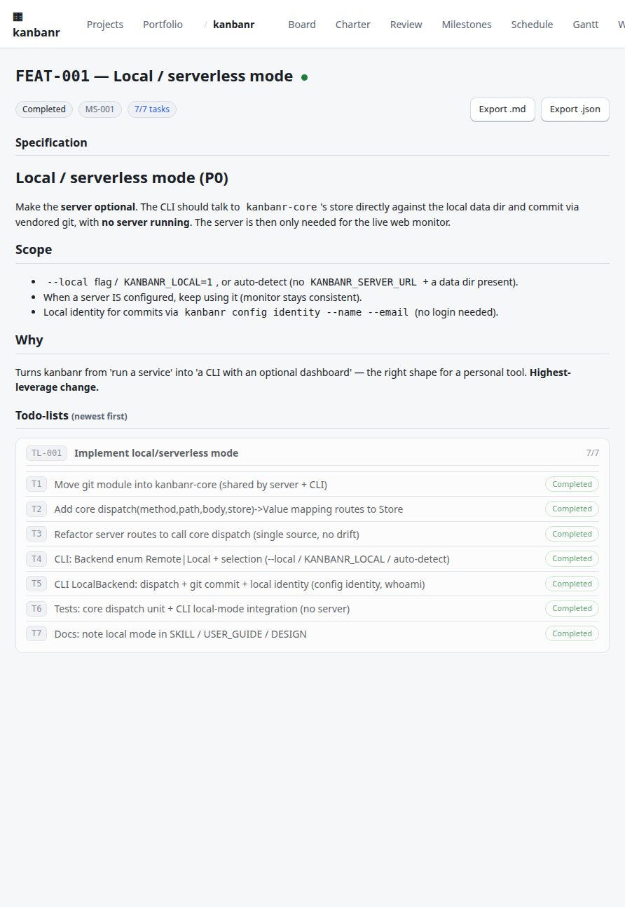</td>
    <td>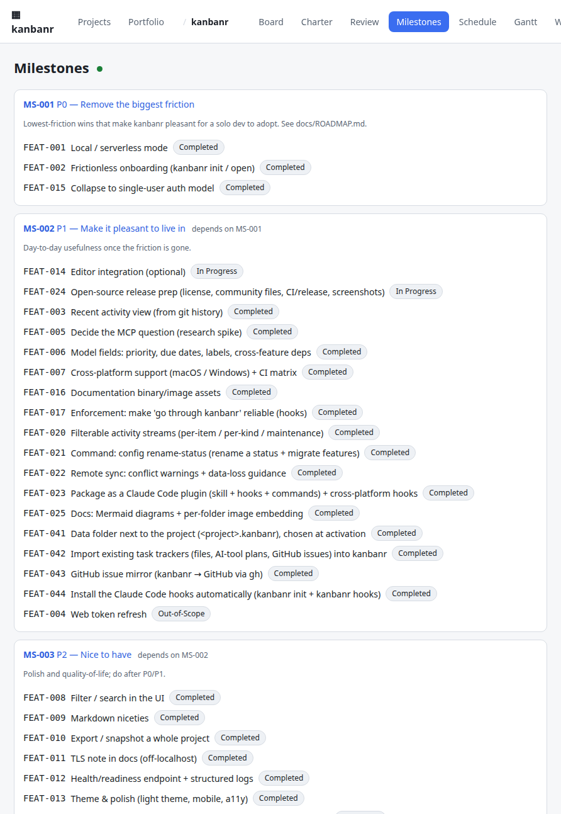</td>
    <td>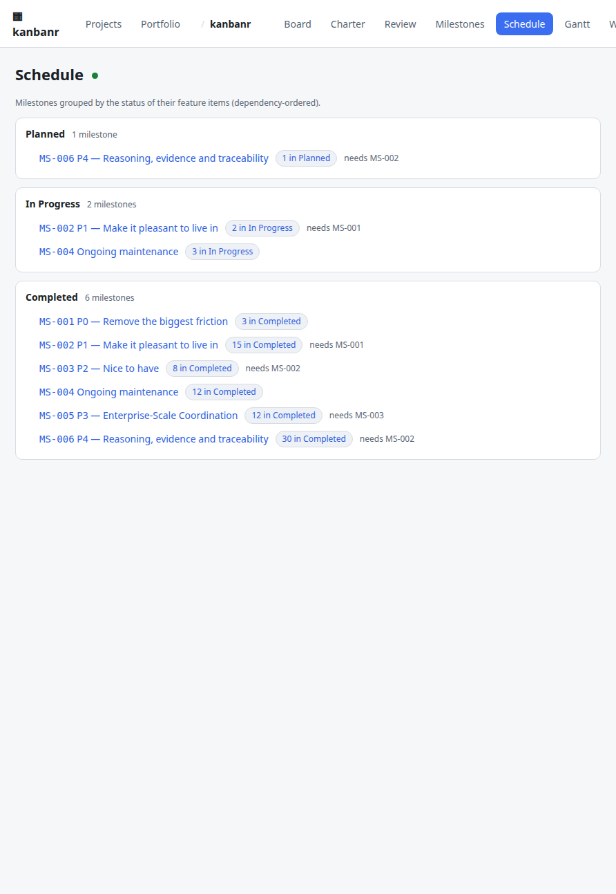</td>
  </tr>
  <tr>
    <td align="center"><sub>Feature item — spec + todo-lists</sub></td>
    <td align="center"><sub>Milestones</sub></td>
    <td align="center"><sub>Schedule (derived)</sub></td>
  </tr>
  <tr>
    <td>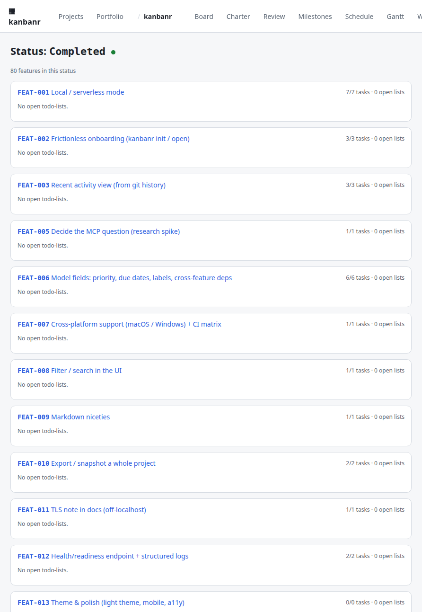</td>
    <td>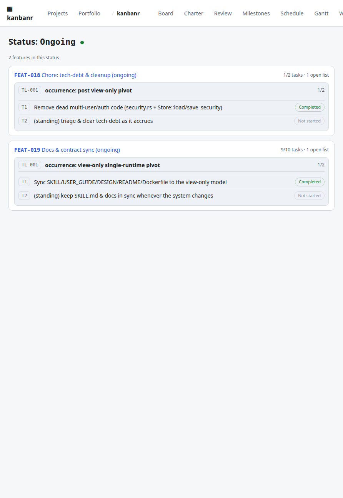</td>
    <td>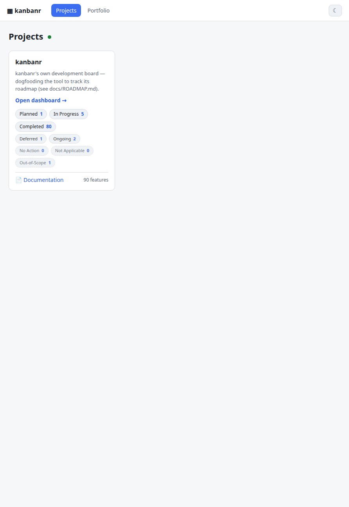</td>
  </tr>
  <tr>
    <td align="center"><sub>Status page (grouped by feature)</sub></td>
    <td align="center"><sub>"Ongoing" — off-board work</sub></td>
    <td align="center"><sub>Home — project tiles</sub></td>
  </tr>
  <tr>
    <td>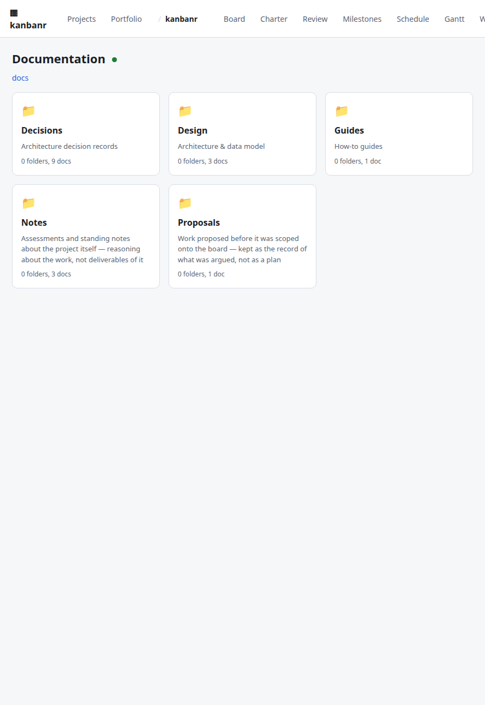</td>
    <td>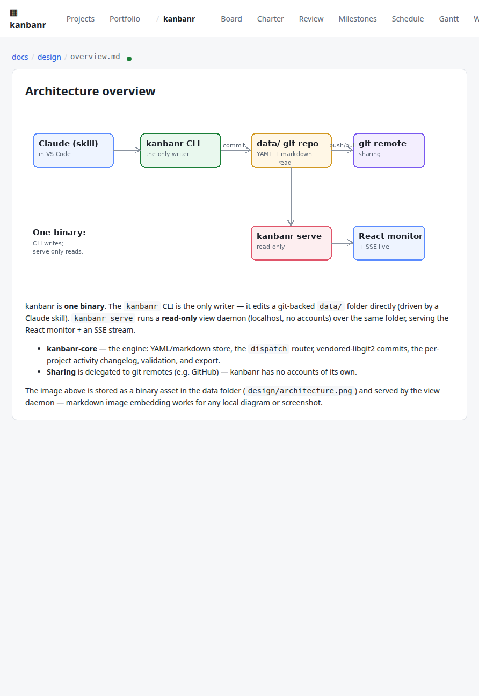</td>
    <td>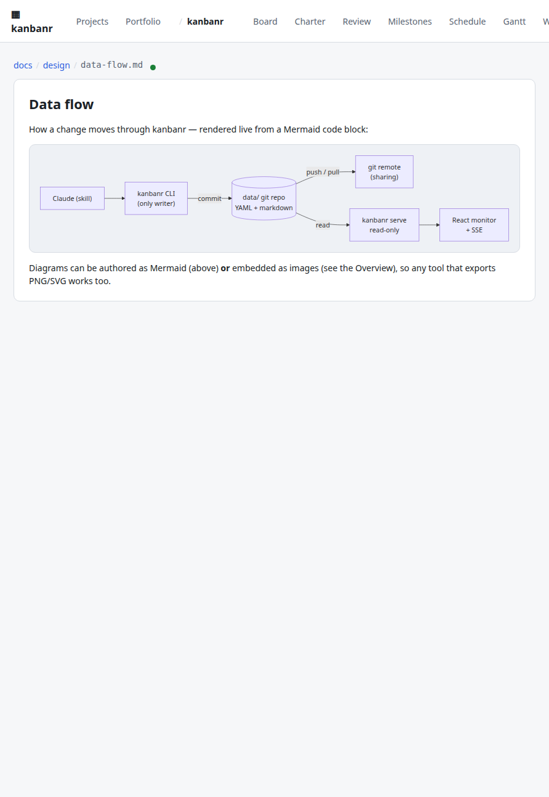</td>
  </tr>
  <tr>
    <td align="center"><sub>Per-project docs (folder tree)</sub></td>
    <td align="center"><sub>Embedded images</sub></td>
    <td align="center"><sub>Live <b>Mermaid</b> diagrams</sub></td>
  </tr>
</table>

Docs support **embedded images** (any PNG/SVG, resolved per-folder and served from the data folder)
and **native Mermaid** diagrams. Any other diagram tool — PlantUML, Graphviz/DOT, D2, Excalidraw,
draw.io — works too: export to PNG/SVG and embed it like any image.

Light theme is the default; one toggle flips the whole UI to dark:

<p align="center">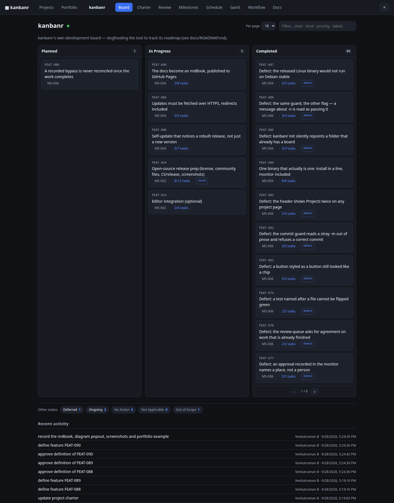</p>

<sub>Screenshots are generated reproducibly via a Selenium Grid in Docker — see
<a href="tools/screenshots/">tools/screenshots/</a> (<code>make screenshots</code>).</sub>

## Model

- **Feature items** (epics) — each has a code (e.g. `FEAT-001`), a markdown **specification**, a
  status, a **required milestone**, and one or more **persistent todo-lists** (add one per work
  session) whose tasks are tri-state (Not started / In progress / Completed).
- **Milestones** — group feature items and depend on other milestones (a dependency DAG). A
  milestone page shows its dependencies and its feature items.
- **Schedule** — a **derived view** (not a stored object): for a given feature status, the
  milestones that contain feature items in that status, dependency-ordered.
- **Configurable workflow** — statuses, allowed transitions, the dashboard's displayed states,
  and the default state for new features are all per-project.
- **Documentation** — a nested folder tree of markdown files per project, with **embedded images**
  (relative names resolve per-folder) and **Mermaid** diagrams; any other diagram tool (PlantUML,
  Graphviz/DOT, D2, Excalidraw, draw.io) works via an exported PNG/SVG.

## Architecture

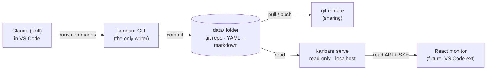

- **One binary, no Docker required.** `kanbanr` writes the data folder directly (the CLI *is* the
  writer — no server, no login, no accounts), and `kanbanr serve` runs a read-only **view daemon**
  over the same folder. Docker is just one optional packaging.
- The data folder is a **git repository**: every write is a commit authored by the configured
  identity (`kanbanr identity`); optional remotes are pulled + pushed after each commit. libgit2 is
  linked in — no external `git` binary. **Sharing/centralization is the git remote's job** (e.g.
  GitHub), so kanbanr has no accounts of its own.
- The **monitor is a localhost, read-only view** of your local folder — no auth. The viewer is
  pluggable (today a React SPA; a VS Code extension is on the roadmap).
- The shared `kanbanr-core` (incl. a `dispatch` router) is the single engine used by both the
  writer and the view daemon.

## How Claude uses it

Say **"start using kanbanr for this project"** once, and Claude adopts kanbanr as the **single
system of record** for the rest of the project — no further instruction needed. Everything about
the project's activity lives in kanbanr (the only thing kept outside it is your conversation
transcript); it uses **persistent todo-lists on feature items** instead of ephemeral session
lists, **recovers/resumes** state at the start of each session, keeps the board updated **before
and after every task**, reviews a feature's spec for **staleness** when moving it out of
`Deferred`, **never deletes** feature items (moves them — e.g. to a no-op state), and bundles
multiple changes into a single **`kanbanr batch`** call. The contract lives in
[skill/kanbanr/SKILL.md](skill/kanbanr/SKILL.md).

The skill and its enforcement hooks are also packaged as a **Claude Code plugin** — install both in
one step with `claude plugin marketplace add startr-trade/kanbanr` then `claude plugin install kanbanr`
(the `kanbanr` binary ships separately; see the [open-sourcing guide](docs/src/project/open-sourcing.md)).

## Repository layout (monorepo)

```
kanbanr/
├── api/      Rust workspace — kanbanr-core (engine: store · dispatch · git · activity) ·
│             kanbanr-cli (the one `kanbanr` binary: local writer + `serve`) ·
│             kanbanr-server (view-daemon library used by `kanbanr serve`)
├── web/      React + Vite read-only monitor (built SPA, served by `kanbanr serve`)
├── docker/   Optional single-image Dockerfile (runs `kanbanr serve`)
├── docs/     USER_GUIDE.md, DESIGN.md, ROADMAP.md, OPEN_SOURCING.md
├── skill/    The Claude skill (skill/kanbanr/SKILL.md)
└── data/     The data git repo: projects/<name>/… (YAML/markdown). No accounts/secrets.
```

## Install

```bash
# macOS / Linux
curl -fsSL https://github.com/startr-trade/kanbanr/releases/latest/download/install.sh | sh

# Windows (PowerShell)
irm https://github.com/startr-trade/kanbanr/releases/latest/download/install.ps1 | iex
```

The installer fetches the binary for your platform, checks it against the release's own
`SHA256SUMS`, and stops there — no shell profile edited, no package manager invoked, no daemon
started. **The web monitor is inside the binary**, so there is no second step and nothing to build.

Or, from source: `make install` (needs Rust and Node), or `docker compose -f docker/docker-compose.yml up`.
Rate limits, pinning a version, checksums, published targets and the glibc floor:
**[the installation chapter](docs/src/getting-started/installation.md)**.

## Quick start (60 seconds)

```bash
kanbanr init my-app --author "You" --email you@example.com   # data dir + git + identity + project
kanbanr milestone add --name Foundations --code MS-001
kanbanr feature add --title "Login flow" --milestone MS-001 --spec "# Login\nEmail + password."
kanbanr board                                  # you now have a populated board
```

That's it — the CLI writes the data folder directly (each change is a git commit). Then develop
with Claude in VS Code: say **"start using kanbanr for this project"** and it takes over the board.

### The live monitor

```bash
kanbanr serve     # the same binary — no --ui-dir, no Docker, no Node
kanbanr open      # opens http://localhost:8080 — no login, just the board
```

`--ui-dir` still overrides the built-in copy, which is what you want while developing the SPA.

The monitor is a localhost read-only view; expose it beyond your machine only behind a reverse
proxy you control. See **[the monitor chapter](docs/src/using/the-monitor.md)**.

## Tests

```bash
make test     # unit tests + Docker-less integration: the real `kanbanr` CLI drives local writes,
              # and `kanbanr serve` serves them read-only over a port — no Docker.
make itest    # packaging smoke (testcontainers): the image boots and serves the view (no auth).
```

## Documentation

The full documentation is an mdBook — searchable, with every page in one table of contents:

**<https://startr-trade.github.io/kanbanr>**

Or read it from this repository under [`docs/src/`](docs/src/SUMMARY.md), or build it locally with
`mdbook serve docs`.

- [Installation](docs/src/getting-started/installation.md) · [Set up in 60 seconds](docs/src/getting-started/quickstart.md)
- [The method](docs/src/using/the-method.md) — why an item exists, and what proves it done
- [Command reference](docs/src/reference/cli.md) · [Architecture](docs/src/architecture/overview.md)
- [Contributing](docs/src/project/contributing.md) · [Roadmap](docs/src/project/roadmap.md)

The project's own assessment, decisions and proposals live on its **board**
(`kanbanr adr list`, `kanbanr doc tree`) rather than in this repository — they are reasoning about
the work, not part of the shipped artifact, and the board is where they stay current.
