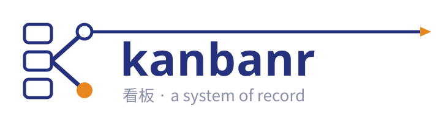
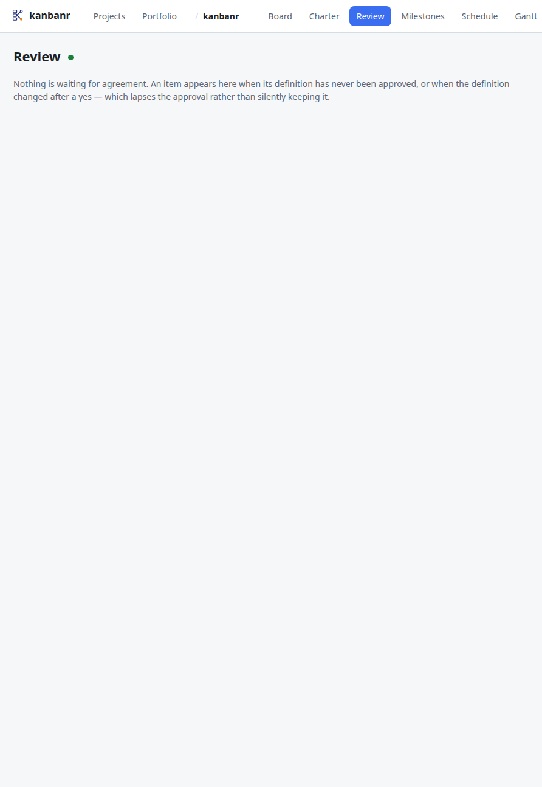
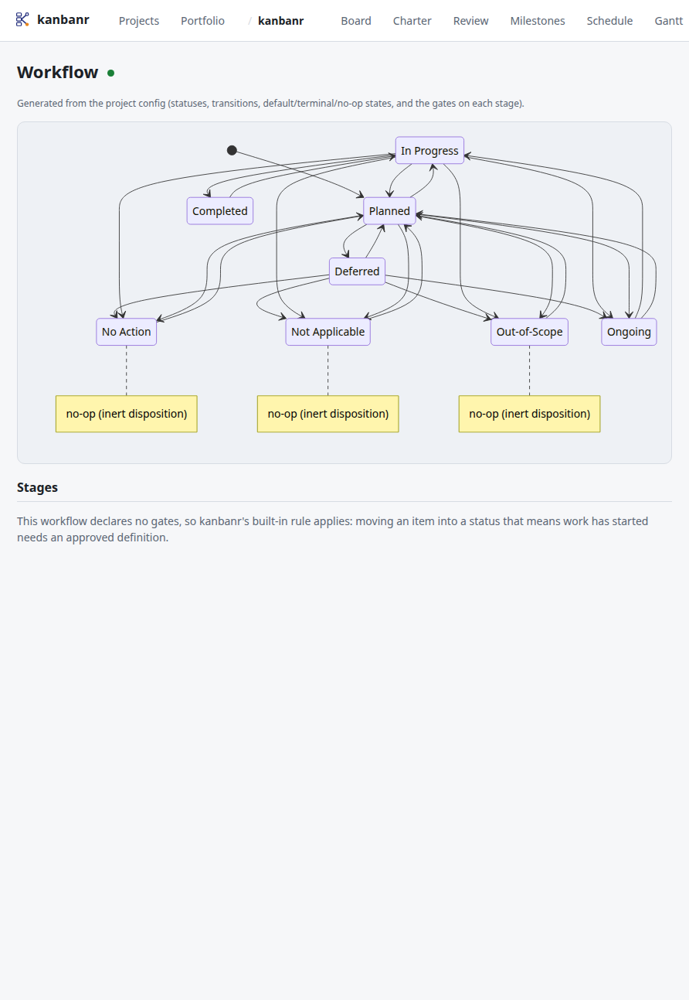
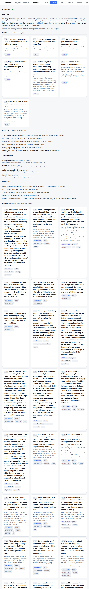
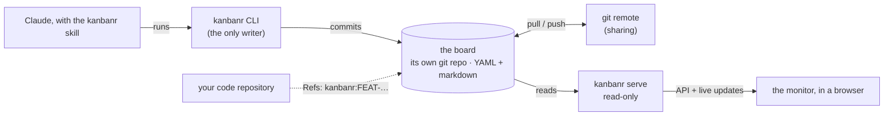

<p align="center">
  <picture>
    <source media="(prefers-color-scheme: dark)" srcset="assets/brand/kanbanr-lockup-dark.svg">
    
  </picture>
</p>

<p align="center">
  <b>A system of record for Claude-driven development.</b><br>
  Plans, reasoning and evidence on a git-backed kanban board — every line of code traced to the
  reason it exists.
</p>

<p align="center">
  <a href="https://github.com/startr-trade/kanbanr/actions/workflows/ci.yml"></a>
  <a href="https://github.com/startr-trade/kanbanr/actions/workflows/codeql.yml"></a>
  <a href="#licence"></a>
  <a href="https://kanbanr.startr.trade"></a>
</p>

## Why

When Claude does real project work, the plan, the reasoning and the evidence live only in the
transcript. They vanish between sessions, nobody can review them, and work gets built that nobody
agreed to. kanbanr keeps all of it in plain, git-backed files a person can read — and makes Claude
keep them current as part of doing the work, not as an afterthought.

## What you get

- **A board Claude recovers from.** Every session starts from the board, not from memory: scope,
  progress and decisions are where it left them. ([Everyday use](docs/src/using/everyday.md))
- **Work that says why it exists.** Each item carries a definition — a statement, the goals it
  serves, the Zachman questions, and [EARS](https://alistairmavin.com/ears/) requirements each
  named with the test that proves it — and is approved before work starts. Edit the definition and
  the approval lapses. ([The method](docs/src/using/the-method.md))
- **Your process, as configuration.** Default kanban, Scrum, agile, TOGAF, PDCA, a design-control
  flow, or your own file: each stage declares what an item needs to enter it, which named people
  sign off, and whether a gap blocks or warns. `kanbanr check` says what the next stage needs.
  ([Processes, gates and sign-offs](docs/src/using/processes.md))
- **Sprints and releases, when you want them.** Points, capacity, a burndown derived from what
  actually moved, release notes cut from finished work — off unless a project turns them on.
  ([Sprints and releases](docs/src/using/processes.md#sprints-and-releases))
- **Code traced to its reason.** Commits carry `Refs: kanbanr:FEAT-…`, the git and Claude Code
  guards refuse ones that don't, and `kanbanr why <file>:<line>` names the requirement and goal
  behind any line. ([Traceability](docs/src/using/traceability.md))
- **A live, read-only monitor.** The board, items, review queue, sprints, Gantt, workflow and
  docs, updating as Claude works. ([The monitor](docs/src/using/the-monitor.md))
- **Local-first, one binary.** Plain YAML and markdown in a git repository: no database, no
  accounts, no server. Share through a git remote. ([How the pieces fit](docs/src/getting-started/how-it-fits.md))

<p align="center"></p>

<table>
  <tr>
    <td></td>
    <td></td>
    <td></td>
  </tr>
  <tr>
    <td align="center"><sub>An item: why it exists, and what proves it</sub></td>
    <td align="center"><sub>Review: approve, ratify, sign off</sub></td>
    <td align="center"><sub>The workflow and its gates</sub></td>
  </tr>
  <tr>
    <td></td>
    <td></td>
    <td></td>
  </tr>
  <tr>
    <td align="center"><sub>A running sprint and its burndown</sub></td>
    <td align="center"><sub>Releases</sub></td>
    <td align="center"><sub>The charter, goals and lessons</sub></td>
  </tr>
</table>

<sub>More views — milestones, the schedule, the Gantt, docs with Mermaid diagrams, the portfolio and
dark mode — are in [the monitor chapter](docs/src/using/the-monitor.md). Screenshots are generated by
<code>make screenshots</code>.</sub>

## Quick start

```bash
# macOS / Linux
curl -fsSL https://github.com/startr-trade/kanbanr/releases/latest/download/install.sh | sh
# Windows (PowerShell)
irm https://github.com/startr-trade/kanbanr/releases/latest/download/install.ps1 | iex
```

One binary, checked against the release's `SHA256SUMS`, with the monitor **and the Claude Code
skill** inside it: when Claude Code is installed, the installer puts the matching skill in place
too (`--no-skill` to skip; [other ways](docs/src/getting-started/installation.md#install-the-skill)).
Then, in your project, ask Claude to **"set up kanbanr for this project"**: it interviews you in plan mode —
where the board lives, your identity, a charter drafted from your repository, and the process —
and sets everything up when you approve the plan. Or from a terminal:

```bash
kanbanr init my-app --author "You" --email you@example.com   # a board beside the repository
kanbanr serve                                                # the live monitor
```

[Installation](docs/src/getting-started/installation.md) covers pinning a version, building from
source and Docker; [Set up in 60 seconds](docs/src/getting-started/quickstart.md) walks through the
first board.

## Developed with kanbanr

kanbanr is built the way it asks you to build: its own board is the system of record for its
development, and it is public — **<https://github.com/startr-trade/kanbanr-board>**.

- **Why it exists:** the [charter](https://github.com/startr-trade/kanbanr-board/blob/main/projects/kanbanr/charter.yaml) — the purpose, the goals every item links to
  (`G-1` … `G-5`), and what is deliberately out of scope.
- **Every item says why and how it is verified.** For example [FEAT-128](https://github.com/startr-trade/kanbanr-board/blob/main/projects/kanbanr/features/Completed/FEAT-128.yaml):
  a statement, the goals it serves, Zachman answers, EARS requirements, and the named tests that
  turned them green — agreed to before the work started.
- **Decisions and what was learned:** the [architecture decisions](https://github.com/startr-trade/kanbanr-board/tree/main/projects/kanbanr/docs/decisions), the
  [milestone retrospectives](https://github.com/startr-trade/kanbanr-board/tree/main/projects/kanbanr/docs/retros), and the [lessons](https://github.com/startr-trade/kanbanr-board/blob/main/projects/kanbanr/lessons.yaml) a new item is
  checked against.
- **Every commit names its item.** `git log` here carries `Refs: kanbanr:FEAT-…` trailers, and the
  commit hooks refuse one that names nothing.
- **Any line traces back to its reason:**

  ```console
  $ kanbanr why api/crates/kanbanr-core/src/git.rs:40
  api/crates/kanbanr-core/src/git.rs:40 — from the annotation on the code: FEAT-128

    requirement  FEAT-128/R-1: WHEN a data repository is created, THE SYSTEM SHALL author its first commit with the user's identity.
    …
  ```

To browse it live, clone the board beside this repository — the committed `.kanbanr` already
points there:

```bash
git clone https://github.com/startr-trade/kanbanr-board ../kanbanr-board
kanbanr board          # the kanban, in the terminal
kanbanr serve          # the live monitor
```

## How it works



- **The CLI is the only writer.** It writes the board folder directly; each change is a git commit
  authored by you. `kanbanr serve` is a read-only view of the same folder.
- **The board is its own git repository**, beside your code. Sharing is a git remote, which is also
  the access boundary — there are no accounts.
- **Claude drives it through a skill** ([SKILL.md](skill/kanbanr/SKILL.md)) and keeps it honest
  through hooks: the session starts from the board, a turn that changed code is reminded to record
  it, commits must name their item, and notes go to the board, not the code repository.

More in [the architecture chapter](docs/src/architecture/overview.md).

## Documentation

**<https://kanbanr.startr.trade>** — or [`docs/src/`](docs/src/SUMMARY.md) in this repository,
`mdbook serve docs` to build it locally. What stays compatible from 1.0 — the board format, the
CLI and its `--json`, the monitor's API — is in [Stability](docs/src/project/stability.md).

## Contributing

The bar is the same for everyone, the maintainer included: say why the change exists, and prove
each requirement with a test that passed. `make ci` runs every CI check locally. See
[Contributing](docs/src/project/contributing.md).

## Licence

Dual-licensed under [MIT](LICENSE-MIT) or [Apache-2.0](LICENSE-APACHE), at your option.
