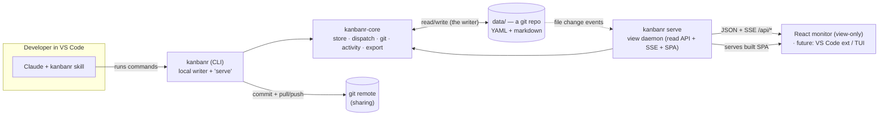
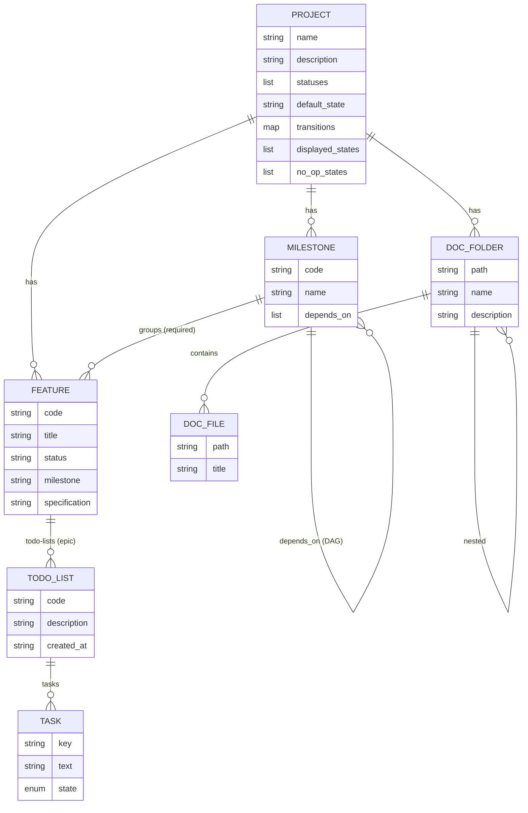
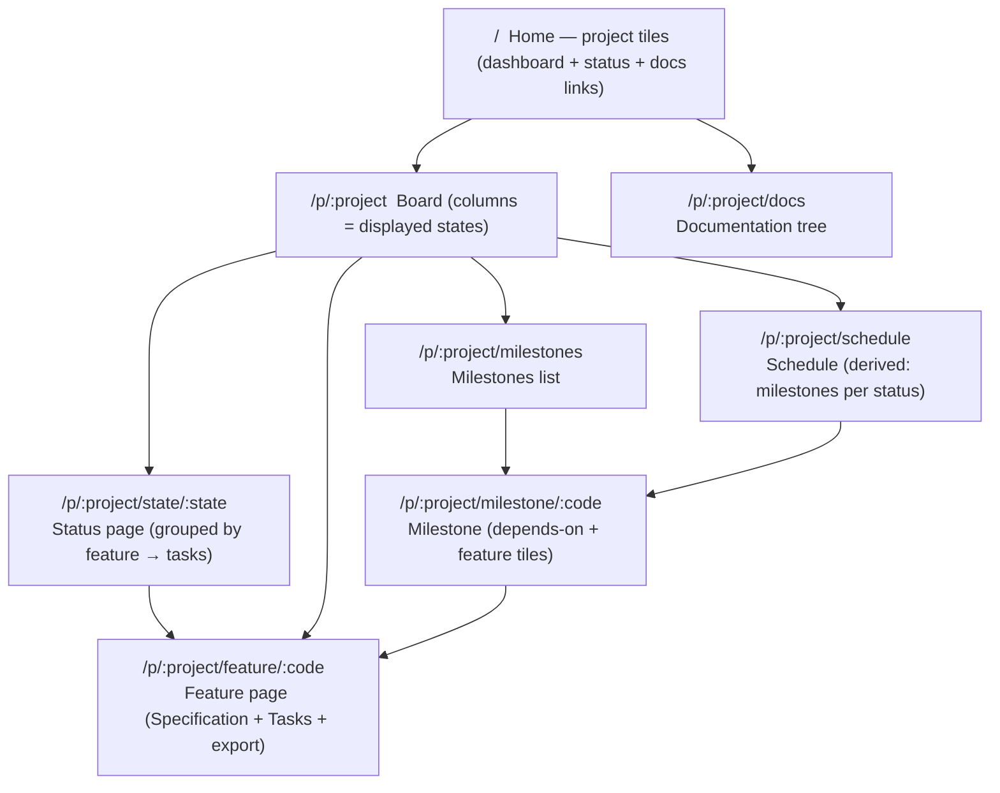

# kanbanr — Design

Architecture, data model, on-disk layout, security, and runtime flows. Diagrams use
[Mermaid](https://mermaid.js.org/) (rendered by GitHub and VS Code).

## 1. Goals & principles

- **YAML/markdown files only** — no database; human-readable and version-controllable.
- **The CLI is the single writer** — it edits the local data folder **directly** (store +
  `dispatch` + git). There is no server in the write path, no login, no accounts.
- **The view is a read-only, localhost monitor** — `kanbanr serve` serves the read API + live SSE +
  the SPA over the same folder. No auth (expose beyond localhost only behind a reverse proxy). The
  viewer is pluggable (today a React SPA; a VS Code extension is on the roadmap).
- **Git is the sharing/centralization boundary** — the data folder is a git repo; every write is a
  commit by the configured identity (`kanbanr identity`); optional remotes are pulled + pushed
  after each commit. **Merge conflicts are left for normal git resolution** — kanbanr never
  auto-resolves.
- **One runtime, no Docker required** — a single `kanbanr` binary is both the writer and (via
  `kanbanr serve`) the view daemon. Docker is just one optional packaging.
- **On-disk layout mirrors the board** — feature items live in a folder named after their status.
- **Multi-project** — one data dir with a folder per project.

## 2. Components



`kanbanr-core` is the engine (models, store, validation, git, the activity changelog, and a
`dispatch` router that maps `(method, path, body)` onto store calls — the single source of truth
for data operations). The **CLI** links it to write the folder directly; the **view daemon**
(`kanbanr-server`, a library run by `kanbanr serve`) links it to read. Both go through `dispatch`,
so they agree by construction. It's all one binary.

## 3. Runtime: one writer, a read-only view, git

```mermaid
sequenceDiagram
  participant C as Claude (skill)
  participant K as kanbanr (CLI, writer)
  participant R as data/ (git repo)
  participant D as kanbanr serve (view)
  participant B as Browser (monitor)

  B->>D: GET /api/projects/:p   (no auth)
  B->>D: open SSE /api/projects/:p/events
  C->>K: edit (add feature / move / task …)
  K->>R: dispatch -> write YAML/md, append activity.yaml, git commit (configured identity)
  K->>R: pull + push remotes (best-effort; conflicts left for normal git)
  R-->>D: file change event (notify)
  D-->>B: SSE "changed" -> refetch live
```

- **No accounts, no JWT.** The writer is you on your machine; the view is a localhost read-only
  window onto your files. **Access control for sharing is the git remote's job** (e.g. GitHub
  decides who can pull/push the data repo).
- **Identity** for commits comes from the data repo's git config (`kanbanr identity --name --email`),
  the same in every write.
- **Git** uses `git2`/libgit2, statically linked — no external `git` binary. Sync is best-effort and
  never blocks a write; a conflict aborts the merge cleanly and is resolved with normal git in the
  folder.
- **Exposure.** `kanbanr serve` binds `127.0.0.1` by default and has no TLS/auth by design. To
  reach it from another machine, leave the bind alone and put it behind a reverse proxy that
  terminates TLS and adds auth (Caddy/nginx examples in
  [USER_GUIDE.md](USER_GUIDE.md#exposing-the-monitor-beyond-localhost)).

## 4. Data model



- **Status** is a configurable label; **transitions** is a map `from → [allowed to]`;
  `displayed_states` is the ordered subset the dashboard shows; `default_state` is the status a
  new feature starts in. **`no_op_states`** flags statuses that are inert dispositions (e.g.
  "No Action", "Not Applicable", "Out-of-Scope"): always non-displayed (kept disjoint from
  `displayed_states`), and a feature in a no-op state does **not** auto-advance to Completed.
- **Permanence / referential integrity:** feature items are **never deletable** (the work is
  permanent). A milestone can be deleted only when unreferenced; a status removed only when no
  feature is in it; a project deleted only when it has no features and no milestones — so any
  project with work is locked from deletion.
- A feature's **milestone is required**. A feature acts as an **epic**: it holds many persistent
  **todo-lists** (one added per work session), each with its own tasks (keys unique per list).
  `TASK.state` is `NotStarted | InProgress | Completed`; when every task across ALL the feature's
  todo-lists is Completed, the feature auto-advances to a "Completed" status when allowed.
  Todo-lists are displayed newest-first; the status page shows only the not-fully-completed ones.
- **There is no Schedule entity.** A "schedule" is derived: for a status, the milestones holding
  features in that status (dependency-ordered).

## 5. On-disk layout

```
data/                                   # a git repository (every write is a commit); no accounts/secrets
└── projects/
    └── <project>/
        ├── config.yaml                 # name, description, statuses, default_state, transitions, displayed_states
        ├── activity.yaml               # the activity changelog (newest-first {time, actor, message})
        ├── <Status>/                   # e.g. Planned/  Scheduled/  Completed/
        │   ├── FEAT-001.yaml            # feature METADATA only (no spec)
        │   └── features-spec/
        │       └── FEAT-001.md          # the specification markdown
        ├── milestones/MS-001.yaml       # code, name, description, depends_on[]
        └── docs/                        # documentation tree (markdown)
            └── design/
                ├── _folder.yaml         # folder name + short description
                └── overview.md
```

Changing a feature's status **moves both** its `<Status>/<code>.yaml` and
`<Status>/features-spec/<code>.md` into the new status folder. All writes are done by the CLI (the
single writer). There is **no** `security.yaml` — kanbanr has no accounts.

## 6. Activity changelog

Each write appends an entry to `projects/<id>/activity.yaml` — a capped, newest-first list of
`{time, actor, message}` (actor = the commit identity; message = a short description of the
change). The view daemon serves it at `GET /api/projects/:p/activity`, and the monitor renders a
"Recent activity" panel. It is plain data in the folder (no git plumbing needed to read it) and
works the same with or without a remote. (The full audit trail still lives in git history.)

## 7. Web navigation map



## 8. HTTP API (the view daemon — read-only, no auth)

The daemon serves **only reads** (writes happen in the CLI, not over HTTP). There is no auth; it
binds localhost by default.

| Method & path | Purpose |
|---|---|
| `GET /healthz` | liveness/readiness probe |
| `GET /api/projects` | project summaries (home tiles) |
| `GET /api/projects/:p` | full project (config, features, milestones) |
| `GET /api/projects/:p/features/:code/export?format=md\|json` | Claude-ready export |
| `GET /api/projects/:p/docs` · `…/docs/content?path=` | docs tree / a doc's markdown |
| `GET /api/projects/:p/activity` | recent activity (the changelog) |
| `GET /api/projects/:p/events` · `GET /api/events` | SSE change streams |

### Writes happen in the CLI (`dispatch`)

All mutations go through `kanbanr-core::dispatch` from the CLI (and the same `(method, path,
body)` shapes the daemon would *read*): create/edit projects, features (never deletable), tasks,
todo-lists, milestones, config, docs — plus `POST /projects/:p/batch` for a bundle in one commit.
Each write appends to the activity log and commits the data repo. The **batch** body is
`{ "operations": [ { "op": "...", ... } ] }` with op types `feature.add`, `feature.edit`,
`feature.move`, `milestone.add`, `todo.add`, `task.add`, `task.state`, `doc.folder`, `doc.write`;
created items may carry a `ref` alias later ops reference; the first failure names its index.

## 9. Workflow contract (how Claude uses it)

kanbanr is designed to be the **single system of record** for a project's activity — the only
project information that stays outside it is the raw conversation transcript. The skill
(`skill/kanbanr/SKILL.md`) encodes the behavioral contract: adopt kanbanr for the whole project
on one trigger phrase ("start using kanbanr for this project"); never track work in an
ephemeral/in-session list (use persistent todo-lists on feature items); recover/resume state from
kanbanr at the start of each session; keep it updated before and after every task; review a
feature's spec for staleness when moving it out of `Deferred`; never delete feature items (move
them, e.g. to a no-op state); model every kind of work as a work item (feature/chore/recurring,
ongoing items in a non-displayed status); and prefer one `batch` call to bundle changes. The
durable, file-backed data model makes the project resumable across sessions by design.

## 10. Testing

Testing is **two-layered**:

- **Unit tests** (`kanbanr-core`): the `dispatch` router, transition validation, code generation,
  milestone DAG cycle detection, all-tasks-done auto-complete (across todo-lists), status-folder
  file moves, milestone-required.
- **Layer 1 — functional integration** (`api/crates/kanbanr-cli/tests/`): the real coverage, no
  Docker. `local_mode.rs` drives the real **`kanbanr` CLI** writing an **ephemeral data dir under
  the build output (`CARGO_TARGET_TMPDIR`)** — create/move/todo/task, auto-complete, init,
  identity, and that the data dir is a git repo committed under the configured identity.
  `view_daemon.rs` then runs **`kanbanr serve`** over that folder and asserts the read API + the
  activity endpoint serve it **with no auth**.
- **Layer 2 — packaging smoke** (`api/crates/kanbanr-cli/tests/integration.rs`): uses
  **testcontainers** to confirm the real Docker **image** boots, scaffolds a project, and serves
  the read-only view (no auth). It does not re-test business logic (that's layer 1). `#[ignore]`d
  (needs Docker + image); run with `make itest`.
