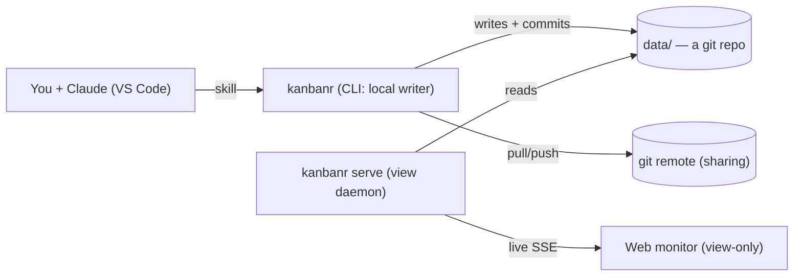
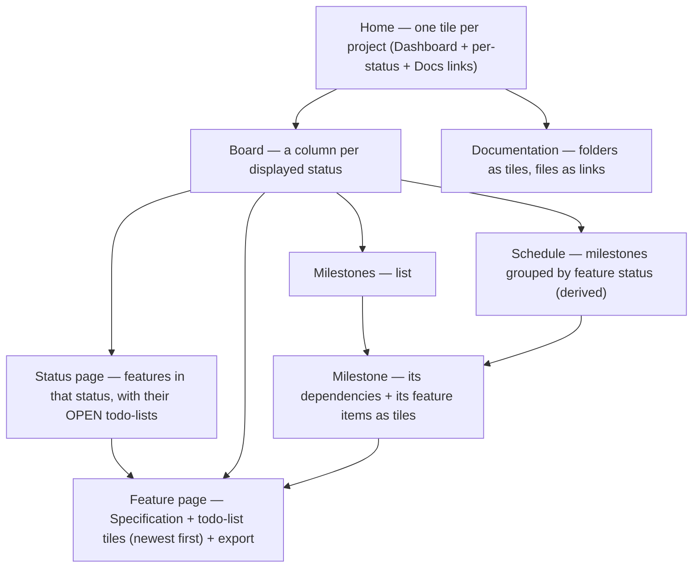

# kanbanr — User Guide

kanbanr helps you plan and track Claude development. **Claude manages the board through the
kanbanr skill** (which runs the `kanbanr` CLI), and a **read-only web monitor** shows it live.

> The **CLI writes the local data folder directly** (the single writer — no server, no login).
> **`kanbanr serve`** runs a read-only **view daemon** over the same folder. Sharing is via git
> remotes. It's **one binary**, no Docker required.

## 1. How the pieces fit



You talk to Claude → Claude runs `kanbanr` commands → the CLI writes the files and commits to git
→ `kanbanr serve` (if running) pushes the change to the monitor live.

## 2. Set up (60 seconds, no server)

```bash
# Install (macOS/Linux) — one binary, monitor included, nothing else to build
curl -fsSL https://github.com/startr-trade/kanbanr/releases/latest/download/install.sh | sh

kanbanr init my-app --author "You" --email you@example.com  # data dir + git repo + identity + project
```

From source instead: `make install`, which builds the SPA, installs the binary and links the skill.
Version pinning, checksums, rate limits, published targets and the glibc floor are in
**[INSTALL.md](INSTALL.md)**.

`init` creates the data dir (a git repo), sets your commit identity, scaffolds a project, and
selects it here (a `.kanbanr` marker). If this folder **already** names a board, `init` refuses
rather than repointing it — the marker is the only link between a project and its board, and
overwriting it makes a full board read as empty. It prints both pointers; `--force` repoints
deliberately, and `kanbanr project use <name>` switches project within the same board. That's everything — there is **no server to run, no login,
no accounts**. Each change you make is a git commit authored by your identity. (libgit2 is linked
in — no external `git` needed.)

`init` also registers kanbanr's two **Claude Code hooks** in your global Claude Code settings
(`~/.claude/settings.json`): one shows the board when a Claude session starts, the other reminds
Claude to record its work. It's done once per machine and merged with your existing settings; the
hooks only act in folders kanbanr tracks. Skip it with `kanbanr init --no-hooks`, and manage it
later with `kanbanr hooks install | status | uninstall`.

### Where the board lives

The board is its own git repo, so it belongs **next to** your project, not inside it. A board
inside the project folder would be a repo nested in your project's repo: it has to be gitignored
and is easy to commit by accident.

`init` asks where to keep it:

```text
Where should kanbanr keep this project's board? (a separate git repo)
  1) /home/you/code/my-app.kanbanr  (new folder next to the project, recommended)
  2) /home/you/code/work.kanbanr    (existing kanbanr folder, shared with its other projects)
Choose a number or type a path [1]:
```

- The recommendation is a sibling of the project's **git repo root** named `<repo>.kanbanr`,
  even if you run `init` from a subfolder.
- Pick an existing kanbanr folder to share one board repo across several projects. Portfolio
  views, cross-project dependencies and the cross-project Gantt work within one data folder.
- Pass `--data-dir <folder>` to skip the question. Without a terminal (e.g. when Claude runs it)
  `init` uses the recommendation; with the skill, Claude asks you first and passes `--data-dir`.
- `init` warns if the folder you pick is inside a git repo.

The choice is recorded in the project's `.kanbanr` marker, relative to the marker:

```yaml
project: my-app
data_dir: ../my-app.kanbanr
```

Every `kanbanr` command run anywhere inside the project finds the marker (it walks up from the
current directory), so no env vars are needed. `kanbanr where` prints the board folder in use.
Commit the marker if everyone who clones the project uses the same layout; otherwise gitignore it.

The data dir resolves from `--data-dir` / `$KANBANR_DATA_DIR` / the marker's `data_dir` / legacy
`./data`. Existing `./data` boards keep working unchanged.

### Importing tasks you already track

If the project already tracks work, in a `TODO.md` or `ROADMAP.md`, in another AI tool's plan files
(Spec Kit, Kiro), or in GitHub issues, Claude offers to import it when you start using kanbanr (or
whenever you ask). It lists what it found and asks which sources to import; by default only open
and in-progress items come in.

- **Preview first.** Claude builds one bundle and shows you the dry run
  (`kanbanr batch --dry-run`), which writes nothing. After you confirm, the import is a single
  commit in the board repo, so it's easy to revert.
- **Nothing is lost if the old tracker goes away.** Each imported item records where it came from
  (`TODO.md:14` at commit `a1b2c3d`, or `owner/repo#123`) and keeps its original text in its spec
  under "Imported from". Whole files are copied into the board's docs under `imports/` before
  they're retired. So the item stays meaningful even if the file is later deleted or the git
  history rewritten.
- **Re-importing is safe.** Items already imported are skipped, matched by issue number or, for
  files, by title (so moving or renumbering a file doesn't import it twice).
- **You decide what happens to the old tracker**: leave it, replace the file with a pointer to
  kanbanr, delete it, or comment on / close GitHub issues with `gh`. Claude never does any of
  that without asking.

`kanbanr sources` (in the project folder) lists imported items and whether their files still
exist; `kanbanr sources --write` records the missing ones, and the monitor shows "source no longer
present" on those items.

## 3. Sharing & the live monitor

**Sharing/centralization is the git remote's job** — whoever can pull/push the data repo is in:

```bash
kanbanr remote add origin git@host:org/data.git    # pulled + pushed after each commit
```

### Conflicts & not losing data

kanbanr is safe by construction: **every change is committed to your local data repo *before* any
remote sync**, so a remote problem can never lose your work. If a push can't go through (the remote
moved on, or a real merge conflict), kanbanr **does not auto-resolve** — it prints a warning with
the exact commands and leaves it to you:

```
kanbanr: remote 'origin': could not push (…). Your change is committed locally, so nothing is
lost. To sync, resolve in the data folder with normal git:
    git -C <data-dir> pull --no-rebase origin <branch>
    git -C <data-dir> push origin <branch>
```

Because the data folder is a **plain git repository**, you resolve exactly as you always do —
`git pull`, fix conflicts (e.g. `git mergetool`), commit the merge, `git push`. Then keep using
`kanbanr` normally. (Tip: for shared data, treat it like code — pull before a work session.)

**The monitor** is a separate, read-only view of your local folder — localhost, no login:

```bash
kanbanr serve --ui-dir web/dist     # the same binary (or: make docker-up)
kanbanr open                        # opens http://localhost:8080 — just the board
```

Expose it beyond localhost only behind a reverse proxy you control.

### Exposing the monitor beyond localhost

`kanbanr serve` binds `127.0.0.1` and has **no auth or TLS by design** — it's a local, read-only
window onto your own files. To reach it from another machine, **don't change the bind**; instead put
a **reverse proxy** in front that terminates **TLS** and adds **authentication**, proxying to the
unchanged `127.0.0.1:8080`. (kanbanr deliberately ships none of this — sharing is otherwise the git
remote's job; see [DESIGN.md](DESIGN.md) §3.) Two minimal working examples:

**Caddy** (automatic HTTPS + basic auth) — `Caddyfile`:

```caddy
board.example.com {
    basic_auth {
        # generate the hash with: caddy hash-password
        you $2a$14$REPLACE_WITH_BCRYPT_HASH
    }
    reverse_proxy 127.0.0.1:8080
}
```

**nginx** (TLS + basic auth) — server block:

```nginx
# create the password file: htpasswd -c /etc/nginx/.htpasswd you
server {
    listen 443 ssl;
    server_name board.example.com;

    ssl_certificate     /etc/ssl/certs/board.example.com.crt;
    ssl_certificate_key /etc/ssl/private/board.example.com.key;

    location / {
        auth_basic           "kanbanr monitor";
        auth_basic_user_file /etc/nginx/.htpasswd;

        proxy_pass http://127.0.0.1:8080;
        proxy_http_version 1.1;
        # SSE: stream live updates without buffering or timing out
        proxy_set_header Connection "";
        proxy_buffering off;
        proxy_read_timeout 1h;
    }
}
```

The proxy enforces who gets in and encrypts the connection; kanbanr behind it stays read-only, so an
authenticated viewer still can't mutate your board — writes only ever happen through the local CLI.

### Mirroring to GitHub issues

If collaborators follow your GitHub issues, kanbanr can keep issues in step with the board using
the GitHub CLI (`gh`). It works **one way**: kanbanr is the source of truth, and issues follow it.

```bash
gh auth login                                  # once
kanbanr mirror enable --repo acme/shop         # public repos also need --allow-public
kanbanr mirror sync --all                      # optional: issues for existing open features
```

After that, every kanbanr change updates GitHub:

| In kanbanr | On GitHub |
|---|---|
| New feature | New issue (title, spec, todo-lists as checklists, labels) |
| Title / spec / labels / tasks change | Issue updated |
| Moved to Completed | Issue closed as completed |
| Moved to a no-op state (e.g. Out-of-Scope) | Issue closed as not planned |

- Only features whose issue would actually change call GitHub. If GitHub can't be reached, the
  change is still saved in kanbanr and a warning is printed; `kanbanr mirror sync` catches up.
  `KANBANR_MIRROR=off` pauses the automatic sync for a session.
- Features imported from GitHub issues stay linked to them, so nothing is duplicated.
  `kanbanr mirror link FEAT-012 45` links an existing issue by hand; its content is replaced by
  kanbanr's on the next sync.
- Edits and comments made on GitHub aren't pulled back automatically. `kanbanr mirror pull FEAT-012`
  shows whether the issue was edited since the last sync, its current content, and new comments,
  so you (or Claude) can bring what matters into kanbanr first.
- `kanbanr mirror status` shows what a sync would do without calling GitHub;
  `kanbanr mirror disable` turns the mirror off and keeps the links.

The mirror refuses a public repository unless you pass `--allow-public`, because specs, task lists
and notes become visible to anyone.

## How Claude uses kanbanr (the contract)

Say **"start using kanbanr for this project"** once. After that, for the rest of the project you
don't have to say anything about kanbanr — Claude treats it as the **single system of record**:

- **Everything about the project's activity lives in kanbanr** — scope, specs, progress, task
  status, decisions, docs. The *only* thing kept outside it is your conversation transcript.
- **Docs live in kanbanr by default.** Any document, whether you asked for it or Claude wrote it on
  its own (design notes, decisions, research, runbooks, plans, guides), is saved as a kanbanr doc
  (`kanbanr doc add …`), not as a file in your codebase. Claude writes a doc into the project
  folder only when you ask, e.g. when you want an mdBook/MkDocs site or README as a deliverable.
- **No ephemeral lists.** Claude does not track project work in a throwaway session list; it
  creates persistent **todo-lists on the feature items** instead — so nothing is lost.
- **Resumable across sessions.** At the start of a session Claude recovers state from kanbanr
  (`kanbanr board`) and continues exactly where things left off.
- **Updated before and after every task** — it reflects what it's about to do (todo-list item →
  In progress) and what it finished (→ Completed, spec/docs updated, status moved).
- When moving a feature **out of `Deferred`**, Claude first reviews its spec for **staleness**.
- **Feature items are never deleted** — to retire one it's moved to a no-op state.
- For several changes at once, Claude sends **one bundled `kanbanr batch` call** (new/edited
  feature items, status moves, new todo-lists + items, task-state updates, doc changes).

## The method: why work exists, and what proves it done

Everything above tracks *what* is being built. This section is about *why* — the part a board
normally loses. It is opt-in: a project with no charter behaves exactly as it always did, and items
created before a charter was adopted are never reported against it.

### The charter — what the project is for

```bash
kanbanr charter show
kanbanr charter set --file charter.yaml     # purpose, vision, goals, non-goals, stakeholders
```

Goals carry ids (`G-1`, `G-2`) that work items link. A goal with no work behind it is a stated
intention nobody is delivering, and the Charter tab shows that; so is an item that serves no goal.

### Defining an item — the bar, and it is the same for everything

```bash
kanbanr feature define FEAT-001 --template --kind defect   # a skeleton shaped to the kind
kanbanr feature define FEAT-001 --file def.yaml            # write it
kanbanr check FEAT-001                                     # what it has not said, and cannot show
```

A definition states the item in one sentence, links a goal, answers the six Zachman dimensions
(what / how / where / when / who / why) in a line each, and carries **requirements** in
[EARS](https://alistairmavin.com/ears/) form with the tests that will prove them. Quality
requirements additionally carry an ISO/IEC 25010 characteristic and a measured scenario whose
measure names the test that checks it.

What varies by kind is only the *shape* of a requirement: a feature asserts new behaviour, a defect
names the requirement it violates, a chore asserts an invariant ("shall continue to …"). The bar
does not move. **Leave what you do not know blank** — `kanbanr doctor` reports a blank; it cannot
report an invented answer.

### Agreement before work

```bash
kanbanr review FEAT-001      # the one-screen decision brief — read this BEFORE building
kanbanr review --pending     # every item waiting, in one pass
kanbanr review --ui          # read and approve in the browser instead (see below)
kanbanr approve FEAT-001     # records agreement, pinned to the definition's content
kanbanr start FEAT-001       # refuses without a current approval
```

Approval is pinned to a hash of the definition, so editing the definition afterwards **lapses** the
approval rather than silently keeping it. The escape is explicit and recorded:
`kanbanr start FEAT-001 --unapproved "why you are going ahead anyway"`, which stays on the item and
is reported by `doctor` until it is reviewed.

**Reviewing in the browser.** Reading a page of markdown in a terminal is a poor way to decide
anything, so `kanbanr review --ui` starts the monitor with writes enabled and opens the review queue:
one collapsible card per item, with the approve button inside the brief it belongs to. The ordinary
`kanbanr serve` monitor stays read-only and says so rather than offering a button that would fail.

The queue holds only items where agreement can still change something — not work that is finished, and
not a status parked off the board. Approving merged work records a signature that changes nothing, and
a gate that asks for those gets rubber-stamped, which is the failure it exists to prevent.

**A verdict names who gave it.** `--by` defaults to the board's commit identity, and the monitor uses
the same one, so a verdict reads identically whichever surface recorded it. A verdict with no named
approver is **refused** rather than attributed to nobody — set an identity once with
`kanbanr identity --name "You" --email you@example.com`. An approval that cannot say who agreed is
not evidence of agreement.

**Taking one back.**

```bash
kanbanr unapprove FEAT-001 --reason "the requirements changed after the walkthrough"
```

The agreement goes and the item returns to the queue, start gate and all; the record of having given
it stays, because an approval given and later withdrawn says more than none ever having existed. A
reason is required — an agreement needs no explanation, taking one back does. The monitor offers the
same action on the item's page, collecting the reason in the page. Both verdicts emit an event
(`ApprovalRecorded`, `ApprovalWithdrawn`) and appear in the activity log.

### Evidence, not intentions

```bash
kanbanr test FEAT-001 R-1 cart::retains green    # normally you never run this by hand
kanbanr tests [--write]                          # tracked tests that no longer exist in the repo
```

A PostToolUse hook reads the output of every test run you make and flips the tracked tests to match,
stamped with the project revision it saw. Name a test exactly as your runner prints it
(`cart::retains_for_seven_days`, `src/cart.test.ts`) or the run cannot find it. A green recorded at
an older revision is reported as **stale evidence**, not as proof; re-running the suite refreshes
it. Mark a check a person performs as `kind: manual` — it is exempt from the rot sweep, so use it
only when a person really did it.

## Measuring what happened

```bash
kanbanr report --since 14d        # throughput, cycle time, rework, escape rate, coverage
kanbanr retro MS-006 --write      # a wave's account, written to a document
kanbanr retro --due               # finished waves whose retro is unwritten
kanbanr defect FEAT-042 --introduced-by FEAT-031 --found-in production --severity high
kanbanr lessons [--for FEAT-001]  # what this project learned, most believed first
kanbanr lesson add "…" --kind pitfall --from FEAT-043 --evidence "what actually happened"
kanbanr lesson affirm L-1 | kanbanr lesson contradict L-1 --note "…"
```

Every number is derived from what the board recorded — status history, defect records, test states
— and anything that cannot be derived is **absent rather than estimated**. Whether a defect
*escaped* is not asked, it is derived: it escaped if the work that introduced it had already been
called done. Lessons lose confidence with age unless something reaffirms them, and one that falls
below the threshold retires: kept as a record, no longer surfaced.

## Tying code to the reason for it

```bash
kanbanr start FEAT-001                       # branches feat/FEAT-001-<slug>, moves the item
kanbanr commit -m "feat(x): …" --ref R-2     # fills in Refs: kanbanr:FEAT-001/R-2
kanbanr finish                               # refuses while tasks are open or requirements unproven
kanbanr git install-hooks                    # commit-msg + pre-commit checks in your repo
kanbanr trace G-2 | FEAT-001 | FEAT-001/R-2  # down the chain, ending in the gaps
kanbanr trace MS-006 --zachman               # which of the six columns nothing addresses
kanbanr why src/cart.rs:42                   # up: annotation or trailer → requirement → goal
kanbanr adr new "…" --affects FEAT-001 --driven-by FEAT-001/R-2 --quality Reliability
kanbanr adr list [--for FEAT-001] | adr supersede ADR-0007 --replaces ADR-0003 | adr history ADR-0007
```

One item, one branch, and every commit says what it serves. The hooks refuse a commit on the
default branch, a branch that names no item, and a message with no reference — and they let through
merges, reverts, `spike/*` branches, and a recorded escape (`[no-ref] <why>` in the message, which
leaves the reason in git history forever). If kanbanr is not on PATH the hooks step aside rather
than making the repository uncommittable for someone who never installed it.

Architecture decisions stay **documents** with front-matter that joins them to the graph: they have
no estimate, branch or tests, so counting them as work items would distort the flow metrics.
Deciding is still work — it is a task on the item that needed the decision, and the ADR is its
output.

## 4. Everyday use — just talk to Claude

| You say to Claude | What the skill runs |
|---|---|
| "Set up kanbanr for this project, states Backlog→Doing→Done, new features start in Backlog" | `kanbanr project init … --statuses Backlog,Doing,Done --default-state Backlog` |
| "Add a Foundations milestone" | `kanbanr milestone add --name Foundations --code MS-001` |
| "Track a feature for the login flow under MS-001 with a spec" | `kanbanr feature add --title "Login flow" --milestone MS-001 --spec "…"` |
| "Start a todo-list for this session on FEAT-001" | `kanbanr todo add FEAT-001 --description "session 1"` (→ TL-001) |
| "Add tasks to TL-001" | `kanbanr task add FEAT-001 TL-001 --text "…"` |
| "Start task T2 in TL-001" / "T2 is done" | `kanbanr task state FEAT-001 TL-001 T2 InProgress` / `Completed` |
| "Move the login feature to Scheduled" | `kanbanr move FEAT-001 Scheduled` |
| "What's on the board?" | `kanbanr board` |
| "Save these API notes under design/api" | `kanbanr doc add design/api …` |

> Every feature requires a milestone — create the milestone first.

## 5. The monitor (read-only) — navigation



- **Home tile**: project name + description, an **Open dashboard** link, a link per **status**
  (with counts), and a **Documentation** link.
- **Board**: one column per state in `displayed_states`; click a card → that feature's page.
- **Status page**: features in one status, grouped by feature, each showing only its **open**
  todo-lists (those not fully completed), newest first, with their tasks.
- **Feature page** (an *epic*): the **Specification** (rendered markdown) and a **tile per
  todo-list** (newest first), each tile holding that list's tasks, plus markdown/JSON export.
  Add a new todo-list per work session — they persist, so multi-session work is never lost.
- **Milestone page**: the milestones it **depends on**, plus its **feature items as tiles**.
- **Schedule**: a *derived* view — for each displayed status, the milestones that contain
  feature items in that status, dependency-ordered. Nothing to create; it always reflects reality.
- **Documentation**: drill from root folders (tiles) into sub-folders and files (any depth);
  files render as markdown.

Everything is **view-only** and refreshes live (a green dot shows the live connection). A
**light/dark theme toggle** sits in the top bar (it remembers your choice and follows your OS
preference by default), and the layout is **responsive** (usable on a phone) with keyboard-focus and
reduced-motion accessibility niceties.

## 6. Configuring the workflow (via the CLI/skill)

```bash
kanbanr config show
kanbanr config set-transition Planned Scheduled --allow      # or --deny
kanbanr config displayed-states Planned,Scheduled,Completed  # which states the dashboard shows
kanbanr config default-state Planned                         # status assigned to new features
kanbanr config no-op-states "No Action,Not Applicable,Out-of-Scope"   # inert dispositions

# Reset / redefine the WHOLE workflow at once (instead of many set-transition calls):
kanbanr config workflow --statuses Backlog,Doing,Done,Dropped --transitions "Backlog>Doing,Doing>Done" \
                        --default-state Backlog --displayed-states Backlog,Doing,Done --no-op-states Dropped
kanbanr config workflow --defaults                           # restore the built-in default workflow
```

For a brand-new project, `kanbanr project init … --statuses … --default-state … --displayed-states …
--no-op-states …` sets everything at creation. `config workflow` resets/redefines it on an existing project.

A feature can only move along an allowed transition; kanbanr rejects anything else. When all of
a feature's tasks are Completed it auto-advances to a "Completed" status if that move is allowed.

**No-op states** are statuses flagged as functionally inert dispositions (new projects ship with
`No Action`, `Not Applicable`, `Out-of-Scope`). They are always **non-displayed** on the board, and
a feature parked in one does **not** auto-complete. Move a feature into one with
`kanbanr move FEAT-001 "Out-of-Scope"`. Non-displayed states (incl. no-op) still have status-page
links on the home tiles and the dashboard.

## Permanence & deletion

- **Feature items can't be deleted** — they're the project's work. To retire one, `move` it to a
  no-op state, don't delete it.
- A **milestone** is removable only when no feature references it.
- A **project** is deletable (`kanbanr project delete <name>`) only when it has no features and no
  milestones — so any project with real work is locked from deletion.

## 7. Documentation folders

Each project carries a nested tree of markdown docs. Organize them into folders, add files (inline
or from disk, at any depth), and browse the tree in the monitor:

```bash
kanbanr doc folder design --name "Design" --description "Architecture & design notes"
kanbanr doc add design/overview.md --content "# Overview\n…"
kanbanr doc add design/customer/portal.md --file ./portal-notes.md   # nested, any depth
kanbanr doc tree
```

### Diagrams & images in docs

Docs are more than text — the viewer renders **diagrams** and **embedded images**:

- **Embedded images.** Add an image as a binary asset, then reference it by a **relative name** from
  a markdown file in the *same folder* (names resolve **per-folder**, so they're meaningful in any
  docs folder — not just one):

  ```bash
  kanbanr doc add design/architecture.png --file ./architecture.png   # store the image asset
  ```
  ```markdown
  <!-- in design/overview.md (same folder) -->
  
  ```
  The view daemon serves the asset from your data folder — nothing leaves your machine.

- **Mermaid diagrams.** A fenced `mermaid` code block renders to a live diagram (flowchart,
  sequence, state, etc.), theme-aware:

  ````markdown
  ```mermaid
  flowchart LR
    A[Claude] --> B[kanbanr CLI] --> C[(data/ git repo)]
  ```
  ````

- **Any other diagram tool** — PlantUML, Graphviz/DOT, D2, Excalidraw, draw.io — works too: export
  it to **PNG/SVG** and embed it as an image asset (as above). Mermaid blocks also render natively on
  GitHub, so the same docs look right in your repo.

## 8. Multiple projects

All projects live under the data dir as `projects/<name>/`. The monitor's home page shows a tile
per project. Select the active project with `--project`, `$KANBANR_PROJECT`, or a `.kanbanr` file
(`kanbanr project use <name>`).

## 9. Tests

- `make test` — Rust unit tests + the Docker-less integration tests: the real CLI writes a local
  data dir, and `kanbanr serve` serves it read-only over a port.
- `make itest` — builds the Docker image and runs the **testcontainers** smoke test (the image
  boots and serves the read-only view, no auth).

## Complete command reference

Everything the CLI does, grouped by what you are trying to find out. `--json` works on every read.

**Setting up and looking around**

| Command | What it does |
|---|---|
| `kanbanr init <name>` | data folder + git repo + identity + project, in one step |
| `kanbanr project init/edit/list/use/delete` | create, rename, select (writes the `.kanbanr` marker) |
| `kanbanr where [--json]` | which board folder this directory uses, and why |
| `kanbanr whoami` / `kanbanr identity` | the commit identity this data folder writes as |
| `kanbanr config show / set-transition / displayed-states / default-state / no-op-states / workflow` | the workflow |
| `kanbanr hooks install / status / uninstall` | the Claude Code hooks (session start, stop nudge, test capture, commit guard) |
| `kanbanr serve [--ui-dir …]` | the read-only monitor over this board |

**The work**

| Command | What it does |
|---|---|
| `kanbanr board` / `kanbanr feature list / show / add / edit` | the kanban and its items |
| `kanbanr move <CODE> <STATUS> [--unapproved "…"]` | a status change, validated against the workflow |
| `kanbanr milestone add / list / edit / delete` | milestones (a dependency DAG; cycles rejected) |
| `kanbanr todo add / list`, `kanbanr task add / state / list` | persistent todo-lists on an item |
| `kanbanr export <CODE> --format md\|json` | one item, rendered for a human or a machine |
| `kanbanr query "text" [--goal G-1] [--gap …] [--all-projects]` | rich filters plus full text, across projects |
| `kanbanr activity` / `kanbanr events` | the changelog, and the notification event log |
| `kanbanr doc folder / add / tree / list / show / rm` | the documentation tree |

**Dependencies and scheduling**

| Command | What it does |
|---|---|
| `kanbanr ready` / `kanbanr blocked` | what can be started now, and what is waiting on something |
| `kanbanr impact <CODE>` | everything downstream of an item — what breaks if it slips |
| `kanbanr graph [--format dot\|json]` | the dependency graph |
| `kanbanr critical-path` / `kanbanr gantt` | the longest chain, and a Mermaid schedule |
| `kanbanr portfolio …` | cross-project rollups for a program of several boards |

**Keeping it honest**

| Command | What it does |
|---|---|
| `kanbanr doctor` | every broken reference and every gap, across the board |
| `kanbanr check [CODE]` | what one item has not said, and what it cannot yet show |
| `kanbanr review [CODE] [--pending] [--ui]` | the decision brief — one item, all of them, or in the browser |
| `kanbanr approve <CODE> [--by …]` | records agreement, attributed to the board's commit identity |
| `kanbanr unapprove <CODE> --reason "…"` | takes an agreement back; the record of having given it stays |
| `kanbanr capture` | reads a test run's output (run by the hook; you never call it) |
| `kanbanr split-from <CODE> <PARENT>` | records that an item was sliced out of another |
| `kanbanr sources [--write]` | imported items whose source file has gone |
| `kanbanr index` | rebuild the per-project cache from the source-of-truth files |

**Sharing**

| Command | What it does |
|---|---|
| `kanbanr remote add / list / remove`, `kanbanr sync` | git remotes for the board, and an immediate push |
| `kanbanr mirror enable / disable / status / sync / link / pull` | one-way mirror of items to GitHub issues |
| `kanbanr batch [--dry-run] [--file …]` | many changes in one call and one commit |

## Housekeeping on the board repository

The board is a git repository and every write is a commit, so an active project accumulates objects.
Nothing breaks if you ignore this — git is designed for it — but two things are worth knowing.

```bash
cd "$(kanbanr where)"
git count-objects -vH      # loose objects and pack size
git gc                     # pack them; safe, and never touches your data
```

A board with a few hundred commits and no pack can hold a few thousand loose objects. `git gc`
collapses that. It compacts storage and changes nothing about content — and it is **not** a way to
reclaim anything: the logs keep every entry deliberately (one file per day under `activity/` and
`events/`), because raw data is never discarded. What is bounded is what a *report* shows you.

If you have a remote configured, an occasional `kanbanr sync` keeps the board pushed; `kanbanr
where --json` tells you which folder is in use and why.

## 10. Troubleshooting

- **`monitor not reachable` from `kanbanr open`** — start the view daemon first:
  `kanbanr serve --ui-dir web/dist` (or `make docker-up`).
- **Commits authored as `kanbanr <kanbanr@local>`** — set your identity:
  `kanbanr identity --name "You" --email you@example.com`.
- **`could not determine project`** — pass `--project`, set `$KANBANR_PROJECT`, or
  `kanbanr project use <name>` (writes a `.kanbanr` marker).
- **`project '…' not found` / an empty board** — you may be pointed at the wrong data folder.
  `kanbanr where --json` shows which folder is in use and why (`--data-dir`, `$KANBANR_DATA_DIR`,
  the marker, or the `./data` fallback).
- **Push/pull conflicts** — the data folder is a normal git repo; resolve in it with `git` as
  usual, then continue.
- **`kanbanr: command not found`** — run `make install` and ensure `~/.cargo/bin` is on PATH.
- **A move was rejected** — the transition isn't allowed; check `kanbanr config show`.
- **A feature add was rejected** — every feature needs an existing `--milestone`.

See **[DESIGN.md](DESIGN.md)** for architecture and on-disk layout.
