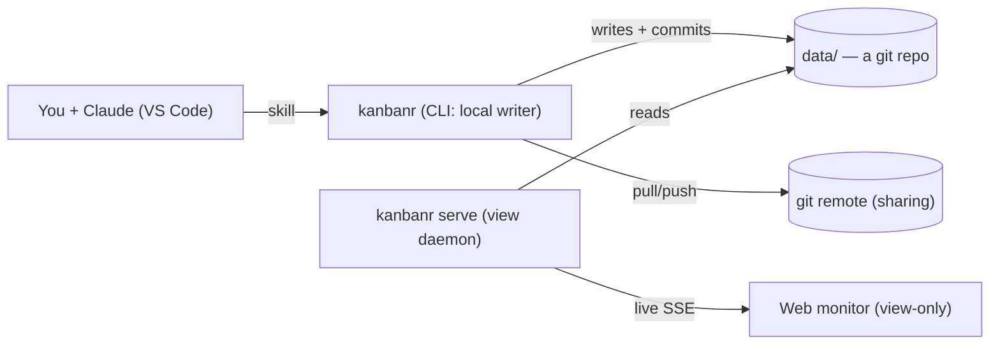

# kanbanr — User Guide

kanbanr helps you plan and track Claude development. **Claude manages the board through the
kanbanr skill** (which runs the `kanbanr` CLI), and a **read-only web monitor** shows it live.

> The **CLI writes the local data folder directly** (the single writer — no server, no login).
> **`kanbanr serve`** runs a read-only **view daemon** over the same folder. Sharing is via git
> remotes. It's **one binary**, no Docker required.

## 1. How the pieces fit



You talk to Claude → Claude runs `kanbanr` commands → the CLI writes the files and commits to git
→ `kanbanr serve` (if running) pushes the change to the monitor live.

## 2. Set up (60 seconds, no server)

```bash
make install                                              # build/install the one `kanbanr` binary + skill
kanbanr init my-app --author "You" --email you@example.com  # data dir + git repo + identity + project
```

`init` creates the data dir (a git repo), sets your commit identity, scaffolds a project, and
selects it here (a `.kanbanr` marker). That's everything — there is **no server to run, no login,
no accounts**. Each change you make is a git commit authored by your identity. (libgit2 is linked
in — no external `git` needed.)

### Where the board lives

The board is its own git repo, so it belongs **next to** your project, not inside it. A board
inside the project folder would be a repo nested in your project's repo: it has to be gitignored
and is easy to commit by accident.

`init` asks where to keep it:

```text
Where should kanbanr keep this project's board? (a separate git repo)
  1) /home/you/code/my-app.kanbanr  (new folder next to the project, recommended)
  2) /home/you/code/work.kanbanr    (existing kanbanr folder, shared with its other projects)
Choose a number or type a path [1]:
```

- The recommendation is a sibling of the project's **git repo root** named `<repo>.kanbanr`,
  even if you run `init` from a subfolder.
- Pick an existing kanbanr folder to share one board repo across several projects. Portfolio
  views, cross-project dependencies and the cross-project Gantt work within one data folder.
- Pass `--data-dir <folder>` to skip the question. Without a terminal (e.g. when Claude runs it)
  `init` uses the recommendation; with the skill, Claude asks you first and passes `--data-dir`.
- `init` warns if the folder you pick is inside a git repo.

The choice is recorded in the project's `.kanbanr` marker, relative to the marker:

```yaml
project: my-app
data_dir: ../my-app.kanbanr
```

Every `kanbanr` command run anywhere inside the project finds the marker (it walks up from the
current directory), so no env vars are needed. `kanbanr where` prints the board folder in use.
Commit the marker if everyone who clones the project uses the same layout; otherwise gitignore it.

The data dir resolves from `--data-dir` / `$KANBANR_DATA_DIR` / the marker's `data_dir` / legacy
`./data`. Existing `./data` boards keep working unchanged.

### Importing tasks you already track

If the project already tracks work, in a `TODO.md` or `ROADMAP.md`, in another AI tool's plan files
(Spec Kit, Kiro), or in GitHub issues, Claude offers to import it when you start using kanbanr (or
whenever you ask). It lists what it found and asks which sources to import; by default only open
and in-progress items come in.

- **Preview first.** Claude builds one bundle and shows you the dry run
  (`kanbanr batch --dry-run`), which writes nothing. After you confirm, the import is a single
  commit in the board repo, so it's easy to revert.
- **Nothing is lost if the old tracker goes away.** Each imported item records where it came from
  (`TODO.md:14` at commit `a1b2c3d`, or `owner/repo#123`) and keeps its original text in its spec
  under "Imported from". Whole files are copied into the board's docs under `imports/` before
  they're retired. So the item stays meaningful even if the file is later deleted or the git
  history rewritten.
- **Re-importing is safe.** Items already imported are skipped, matched by issue number or, for
  files, by title (so moving or renumbering a file doesn't import it twice).
- **You decide what happens to the old tracker**: leave it, replace the file with a pointer to
  kanbanr, delete it, or comment on / close GitHub issues with `gh`. Claude never does any of
  that without asking.

`kanbanr sources` (in the project folder) lists imported items and whether their files still
exist; `kanbanr sources --write` records the missing ones, and the monitor shows "source no longer
present" on those items.

## 3. Sharing & the live monitor

**Sharing/centralization is the git remote's job** — whoever can pull/push the data repo is in:

```bash
kanbanr remote add origin git@host:org/data.git    # pulled + pushed after each commit
```

### Conflicts & not losing data

kanbanr is safe by construction: **every change is committed to your local data repo *before* any
remote sync**, so a remote problem can never lose your work. If a push can't go through (the remote
moved on, or a real merge conflict), kanbanr **does not auto-resolve** — it prints a warning with
the exact commands and leaves it to you:

```
kanbanr: remote 'origin': could not push (…). Your change is committed locally, so nothing is
lost. To sync, resolve in the data folder with normal git:
    git -C <data-dir> pull --no-rebase origin <branch>
    git -C <data-dir> push origin <branch>
```

Because the data folder is a **plain git repository**, you resolve exactly as you always do —
`git pull`, fix conflicts (e.g. `git mergetool`), commit the merge, `git push`. Then keep using
`kanbanr` normally. (Tip: for shared data, treat it like code — pull before a work session.)

**The monitor** is a separate, read-only view of your local folder — localhost, no login:

```bash
kanbanr serve --ui-dir web/dist     # the same binary (or: make docker-up)
kanbanr open                        # opens http://localhost:8080 — just the board
```

Expose it beyond localhost only behind a reverse proxy you control.

### Exposing the monitor beyond localhost

`kanbanr serve` binds `127.0.0.1` and has **no auth or TLS by design** — it's a local, read-only
window onto your own files. To reach it from another machine, **don't change the bind**; instead put
a **reverse proxy** in front that terminates **TLS** and adds **authentication**, proxying to the
unchanged `127.0.0.1:8080`. (kanbanr deliberately ships none of this — sharing is otherwise the git
remote's job; see [DESIGN.md](DESIGN.md) §3.) Two minimal working examples:

**Caddy** (automatic HTTPS + basic auth) — `Caddyfile`:

```caddy
board.example.com {
    basic_auth {
        # generate the hash with: caddy hash-password
        you $2a$14$REPLACE_WITH_BCRYPT_HASH
    }
    reverse_proxy 127.0.0.1:8080
}
```

**nginx** (TLS + basic auth) — server block:

```nginx
# create the password file: htpasswd -c /etc/nginx/.htpasswd you
server {
    listen 443 ssl;
    server_name board.example.com;

    ssl_certificate     /etc/ssl/certs/board.example.com.crt;
    ssl_certificate_key /etc/ssl/private/board.example.com.key;

    location / {
        auth_basic           "kanbanr monitor";
        auth_basic_user_file /etc/nginx/.htpasswd;

        proxy_pass http://127.0.0.1:8080;
        proxy_http_version 1.1;
        # SSE: stream live updates without buffering or timing out
        proxy_set_header Connection "";
        proxy_buffering off;
        proxy_read_timeout 1h;
    }
}
```

The proxy enforces who gets in and encrypts the connection; kanbanr behind it stays read-only, so an
authenticated viewer still can't mutate your board — writes only ever happen through the local CLI.

### Mirroring to GitHub issues

If collaborators follow your GitHub issues, kanbanr can keep issues in step with the board using
the GitHub CLI (`gh`). It works **one way**: kanbanr is the source of truth, and issues follow it.

```bash
gh auth login                                  # once
kanbanr mirror enable --repo acme/shop         # public repos also need --allow-public
kanbanr mirror sync --all                      # optional: issues for existing open features
```

After that, every kanbanr change updates GitHub:

| In kanbanr | On GitHub |
|---|---|
| New feature | New issue (title, spec, todo-lists as checklists, labels) |
| Title / spec / labels / tasks change | Issue updated |
| Moved to Completed | Issue closed as completed |
| Moved to a no-op state (e.g. Out-of-Scope) | Issue closed as not planned |

- Only features whose issue would actually change call GitHub. If GitHub can't be reached, the
  change is still saved in kanbanr and a warning is printed; `kanbanr mirror sync` catches up.
  `KANBANR_MIRROR=off` pauses the automatic sync for a session.
- Features imported from GitHub issues stay linked to them, so nothing is duplicated.
  `kanbanr mirror link FEAT-012 45` links an existing issue by hand; its content is replaced by
  kanbanr's on the next sync.
- Edits and comments made on GitHub aren't pulled back automatically. `kanbanr mirror pull FEAT-012`
  shows whether the issue was edited since the last sync, its current content, and new comments,
  so you (or Claude) can bring what matters into kanbanr first.
- `kanbanr mirror status` shows what a sync would do without calling GitHub;
  `kanbanr mirror disable` turns the mirror off and keeps the links.

The mirror refuses a public repository unless you pass `--allow-public`, because specs, task lists
and notes become visible to anyone.

## How Claude uses kanbanr (the contract)

Say **"start using kanbanr for this project"** once. After that, for the rest of the project you
don't have to say anything about kanbanr — Claude treats it as the **single system of record**:

- **Everything about the project's activity lives in kanbanr** — scope, specs, progress, task
  status, decisions, docs. The *only* thing kept outside it is your conversation transcript.
- **Docs live in kanbanr by default.** Any document, whether you asked for it or Claude wrote it on
  its own (design notes, decisions, research, runbooks, plans, guides), is saved as a kanbanr doc
  (`kanbanr doc add …`), not as a file in your codebase. Claude writes a doc into the project
  folder only when you ask, e.g. when you want an mdBook/MkDocs site or README as a deliverable.
- **No ephemeral lists.** Claude does not track project work in a throwaway session list; it
  creates persistent **todo-lists on the feature items** instead — so nothing is lost.
- **Resumable across sessions.** At the start of a session Claude recovers state from kanbanr
  (`kanbanr board`) and continues exactly where things left off.
- **Updated before and after every task** — it reflects what it's about to do (todo-list item →
  In progress) and what it finished (→ Completed, spec/docs updated, status moved).
- When moving a feature **out of `Deferred`**, Claude first reviews its spec for **staleness**.
- **Feature items are never deleted** — to retire one it's moved to a no-op state.
- For several changes at once, Claude sends **one bundled `kanbanr batch` call** (new/edited
  feature items, status moves, new todo-lists + items, task-state updates, doc changes).

## 4. Everyday use — just talk to Claude

| You say to Claude | What the skill runs |
|---|---|
| "Set up kanbanr for this project, states Backlog→Doing→Done, new features start in Backlog" | `kanbanr project init … --statuses Backlog,Doing,Done --default-state Backlog` |
| "Add a Foundations milestone" | `kanbanr milestone add --name Foundations --code MS-001` |
| "Track a feature for the login flow under MS-001 with a spec" | `kanbanr feature add --title "Login flow" --milestone MS-001 --spec "…"` |
| "Start a todo-list for this session on FEAT-001" | `kanbanr todo add FEAT-001 --description "session 1"` (→ TL-001) |
| "Add tasks to TL-001" | `kanbanr task add FEAT-001 TL-001 --text "…"` |
| "Start task T2 in TL-001" / "T2 is done" | `kanbanr task state FEAT-001 TL-001 T2 InProgress` / `Completed` |
| "Move the login feature to Scheduled" | `kanbanr move FEAT-001 Scheduled` |
| "What's on the board?" | `kanbanr board` |
| "Save these API notes under design/api" | `kanbanr doc add design/api …` |

> Every feature requires a milestone — create the milestone first.

## 5. The monitor (read-only) — navigation

```mermaid
flowchart TD
  Home["Home — one tile per project (Dashboard + per-status + Docs links)"]
  Board["Board — a column per displayed status"]
  Status["Status page — features in that status, with their OPEN todo-lists"]
  Feature["Feature page — Specification + todo-list tiles (newest first) + export"]
  Ms["Milestones — list"]
  MsOne["Milestone — its dependencies + its feature items as tiles"]
  Sched["Schedule — milestones grouped by feature status (derived)"]
  Docs["Documentation — folders as tiles, files as links"]
  Home --> Board --> Status --> Feature
  Board --> Feature
  Board --> Ms --> MsOne --> Feature
  Board --> Sched --> MsOne
  Home --> Docs
```



- **Home tile**: project name + description, an **Open dashboard** link, a link per **status**
  (with counts), and a **Documentation** link.
- **Board**: one column per state in `displayed_states`; click a card → that feature's page.
- **Status page**: features in one status, grouped by feature, each showing only its **open**
  todo-lists (those not fully completed), newest first, with their tasks.
- **Feature page** (an *epic*): the **Specification** (rendered markdown) and a **tile per
  todo-list** (newest first), each tile holding that list's tasks, plus markdown/JSON export.
  Add a new todo-list per work session — they persist, so multi-session work is never lost.
- **Milestone page**: the milestones it **depends on**, plus its **feature items as tiles**.
- **Schedule**: a *derived* view — for each displayed status, the milestones that contain
  feature items in that status, dependency-ordered. Nothing to create; it always reflects reality.
- **Documentation**: drill from root folders (tiles) into sub-folders and files (any depth);
  files render as markdown.

Everything is **view-only** and refreshes live (a green dot shows the live connection). A
**light/dark theme toggle** sits in the top bar (it remembers your choice and follows your OS
preference by default), and the layout is **responsive** (usable on a phone) with keyboard-focus and
reduced-motion accessibility niceties.

## 6. Configuring the workflow (via the CLI/skill)

```bash
kanbanr config show
kanbanr config set-transition Planned Scheduled --allow      # or --deny
kanbanr config displayed-states Planned,Scheduled,Completed  # which states the dashboard shows
kanbanr config default-state Planned                         # status assigned to new features
kanbanr config no-op-states "No Action,Not Applicable,Out-of-Scope"   # inert dispositions

# Reset / redefine the WHOLE workflow at once (instead of many set-transition calls):
kanbanr config workflow --statuses Backlog,Doing,Done,Dropped --transitions "Backlog>Doing,Doing>Done" \
                        --default-state Backlog --displayed-states Backlog,Doing,Done --no-op-states Dropped
kanbanr config workflow --defaults                           # restore the built-in default workflow
```

For a brand-new project, `kanbanr project init … --statuses … --default-state … --displayed-states …
--no-op-states …` sets everything at creation. `config workflow` resets/redefines it on an existing project.

A feature can only move along an allowed transition; kanbanr rejects anything else. When all of
a feature's tasks are Completed it auto-advances to a "Completed" status if that move is allowed.

**No-op states** are statuses flagged as functionally inert dispositions (new projects ship with
`No Action`, `Not Applicable`, `Out-of-Scope`). They are always **non-displayed** on the board, and
a feature parked in one does **not** auto-complete. Move a feature into one with
`kanbanr move FEAT-001 "Out-of-Scope"`. Non-displayed states (incl. no-op) still have status-page
links on the home tiles and the dashboard.

## Permanence & deletion

- **Feature items can't be deleted** — they're the project's work. To retire one, `move` it to a
  no-op state, don't delete it.
- A **milestone** is removable only when no feature references it.
- A **project** is deletable (`kanbanr project delete <name>`) only when it has no features and no
  milestones — so any project with real work is locked from deletion.

## 7. Documentation folders

Each project carries a nested tree of markdown docs. Organize them into folders, add files (inline
or from disk, at any depth), and browse the tree in the monitor:

```bash
kanbanr doc folder design --name "Design" --description "Architecture & design notes"
kanbanr doc add design/overview.md --content "# Overview\n…"
kanbanr doc add design/customer/portal.md --file ./portal-notes.md   # nested, any depth
kanbanr doc tree
```

### Diagrams & images in docs

Docs are more than text — the viewer renders **diagrams** and **embedded images**:

- **Embedded images.** Add an image as a binary asset, then reference it by a **relative name** from
  a markdown file in the *same folder* (names resolve **per-folder**, so they're meaningful in any
  docs folder — not just one):

  ```bash
  kanbanr doc add design/architecture.png --file ./architecture.png   # store the image asset
  ```
  ```markdown
  <!-- in design/overview.md (same folder) -->
  
  ```
  The view daemon serves the asset from your data folder — nothing leaves your machine.

- **Mermaid diagrams.** A fenced `mermaid` code block renders to a live diagram (flowchart,
  sequence, state, etc.), theme-aware:

  ````markdown
  ```mermaid
  flowchart LR
    A[Claude] --> B[kanbanr CLI] --> C[(data/ git repo)]
  ```
  ````

- **Any other diagram tool** — PlantUML, Graphviz/DOT, D2, Excalidraw, draw.io — works too: export
  it to **PNG/SVG** and embed it as an image asset (as above). Mermaid blocks also render natively on
  GitHub, so the same docs look right in your repo.

## 8. Multiple projects

All projects live under the data dir as `projects/<name>/`. The monitor's home page shows a tile
per project. Select the active project with `--project`, `$KANBANR_PROJECT`, or a `.kanbanr` file
(`kanbanr project use <name>`).

## 9. Tests

- `make test` — Rust unit tests + the Docker-less integration tests: the real CLI writes a local
  data dir, and `kanbanr serve` serves it read-only over a port.
- `make itest` — builds the Docker image and runs the **testcontainers** smoke test (the image
  boots and serves the read-only view, no auth).

## 10. Troubleshooting

- **`monitor not reachable` from `kanbanr open`** — start the view daemon first:
  `kanbanr serve --ui-dir web/dist` (or `make docker-up`).
- **Commits authored as `kanbanr <kanbanr@local>`** — set your identity:
  `kanbanr identity --name "You" --email you@example.com`.
- **`could not determine project`** — pass `--project`, set `$KANBANR_PROJECT`, or
  `kanbanr project use <name>` (writes a `.kanbanr` marker).
- **`project '…' not found` / an empty board** — you may be pointed at the wrong data folder.
  `kanbanr where --json` shows which folder is in use and why (`--data-dir`, `$KANBANR_DATA_DIR`,
  the marker, or the `./data` fallback).
- **Push/pull conflicts** — the data folder is a normal git repo; resolve in it with `git` as
  usual, then continue.
- **`kanbanr: command not found`** — run `make install` and ensure `~/.cargo/bin` is on PATH.
- **A move was rejected** — the transition isn't allowed; check `kanbanr config show`.
- **A feature add was rejected** — every feature needs an existing `--milestone`.

See **[DESIGN.md](DESIGN.md)** for architecture and on-disk layout.
