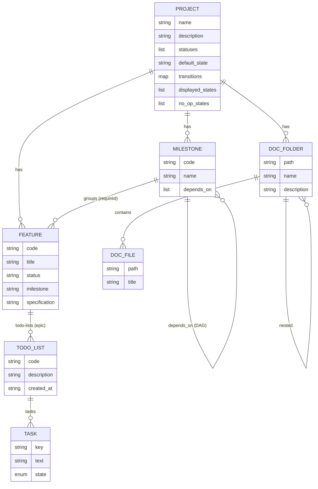

# The data model

## Data model

- **Status** is a configurable label; **transitions** is a map `from → [allowed to]`;
  `displayed_states` is the ordered subset the dashboard shows; `default_state` is the status a
  new feature starts in. **`no_op_states`** flags statuses that are inert dispositions (e.g.
  "No Action", "Not Applicable", "Out-of-Scope"): always non-displayed (kept disjoint from
  `displayed_states`), and a feature in a no-op state does **not** auto-advance to Completed.
- **Permanence / referential integrity:** feature items are **never deletable** (the work is
  permanent). A milestone can be deleted only when unreferenced; a status removed only when no
  feature is in it; a project deleted only when it has no features and no milestones — so any
  project with work is locked from deletion.
- A feature's **milestone is required**. A feature acts as an **epic**: it holds many persistent
  **todo-lists** (one added per work session), each with its own tasks (keys unique per list).
  `TASK.state` is `NotStarted | InProgress | Completed`; when every task across ALL the feature's
  todo-lists is Completed, the feature auto-advances to a "Completed" status when allowed.
  Todo-lists are displayed newest-first; the status page shows only the not-fully-completed ones.
- **There is no Schedule entity.** A "schedule" is derived: for a status, the milestones holding
  features in that status (dependency-ordered).

## Activity changelog

Each write appends an entry to `projects/<id>/activity/<YYYY-MM-DD>.yaml` — `{time, actor, message,
item}`, where actor is the commit identity and message a short description of the change. Events
(FEAT-036) are stored the same way under `events/`.

**Nothing is ever trimmed** (FEAT-066). An earlier version kept one capped file, which meant the log
quietly discarded its own oldest entries — and a retrospective reading a wave that had aged out
reported "no recorded moves", which reads as *nothing happened* rather than *the evidence was
deleted*. One file per day instead: a read walks the days newest-first and stops once it has enough,
so bounding the read costs nothing while the raw record stays complete. Summaries are derived from
it; it is never derived from them.

The view daemon serves it at `GET /api/projects/:p/activity`, and the monitor renders a "Recent
activity" panel. It is plain data in the folder (no git plumbing needed to read it) and works the
same with or without a remote. (The full audit trail still lives in git history.)
