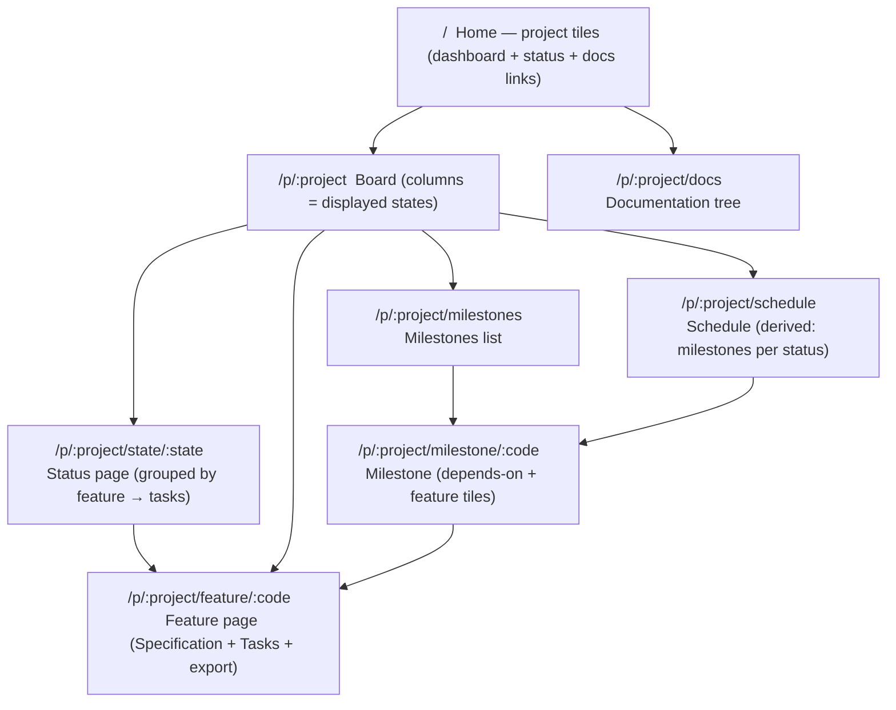

# The monitor's navigation map

## Web navigation map

```mermaid
flowchart TD
  Home["/  Home — project tiles (dashboard + status + docs links)"]
  Board["/p/:project  Board (columns = displayed states)"]
  Status["/p/:project/state/:state  Status page (grouped by feature → tasks)"]
  Feature["/p/:project/feature/:code  Feature page (Specification + Tasks + export)"]
  Ms["/p/:project/milestones  Milestones list"]
  MsOne["/p/:project/milestone/:code  Milestone (depends-on + feature tiles)"]
  Sched["/p/:project/schedule  Schedule (derived: milestones per status)"]
  Docs["/p/:project/docs  Documentation tree"]

  Home --> Board --> Status --> Feature
  Board --> Feature
  Board --> Ms --> MsOne --> Feature
  Board --> Sched --> MsOne
  Home --> Docs
```
