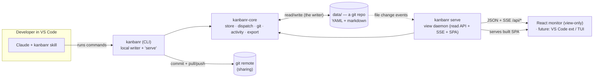
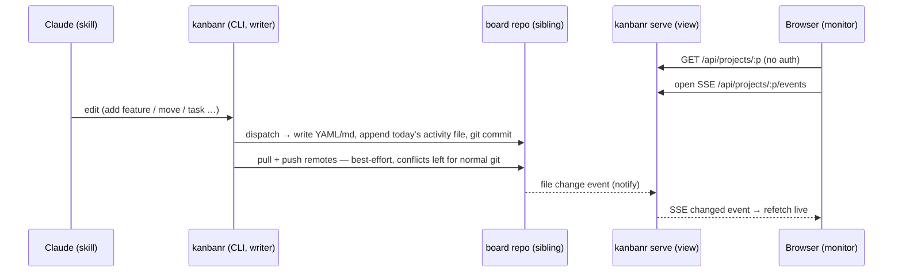

# Architecture overview

## Goals & principles

- **YAML/markdown files only** — no database; human-readable and version-controllable.
- **The CLI is the single writer** — it edits the local data folder **directly** (store +
  `dispatch` + git). There is no server in the write path, no login, no accounts.
- **The view is a read-only, localhost monitor** — `kanbanr serve` serves the read API + live SSE +
  the SPA over the same folder. No auth (expose beyond localhost only behind a reverse proxy). The
  viewer is pluggable (today a React SPA; a VS Code extension is on the roadmap).
- **Git is the sharing/centralization boundary** — the data folder is a git repo; every write is a
  commit by the configured identity (`kanbanr identity`); optional remotes are pulled + pushed
  after each commit. **Merge conflicts are left for normal git resolution** — kanbanr never
  auto-resolves.
- **One runtime, no Docker required** — a single `kanbanr` binary is both the writer and (via
  `kanbanr serve`) the view daemon. Docker is just one optional packaging.
- **On-disk layout mirrors the board** — feature items live in a folder named after their status.
- **Multi-project** — one data dir with a folder per project.

## Components

`kanbanr-core` is the engine (models, store, validation, git, the activity changelog, and a
`dispatch` router that maps `(method, path, body)` onto store calls — the single source of truth
for data operations). The **CLI** links it to write the folder directly; the **view daemon**
(`kanbanr-server`, a library run by `kanbanr serve`) links it to read. Both go through `dispatch`,
so they agree by construction. It's all one binary.

## Runtime: one writer, a read-only view, git

- **No accounts, no JWT.** The writer is you on your machine; the view is a localhost read-only
  window onto your files. **Access control for sharing is the git remote's job** (e.g. GitHub
  decides who can pull/push the data repo).
- **Identity** for commits comes from the data repo's git config (`kanbanr identity --name --email`),
  else the user's own git identity, the same in every write — the first commit included. With
  neither, kanbanr refuses the write rather than commit as a placeholder.
- **Git** uses `git2`/libgit2, statically linked — no external `git` binary. Sync is best-effort and
  never blocks a write; a conflict aborts the merge cleanly and is resolved with normal git in the
  folder.
- **Exposure.** `kanbanr serve` binds `127.0.0.1` by default and has no TLS/auth by design. To
  reach it from another machine, leave the bind alone and put it behind a reverse proxy that
  terminates TLS and adds auth (Caddy/nginx examples in
  [USER_GUIDE.md](USER_GUIDE.md#exposing-the-monitor-beyond-localhost)).
