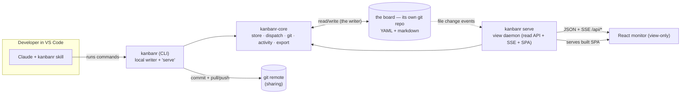
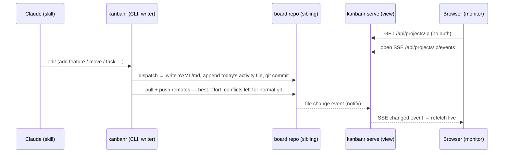
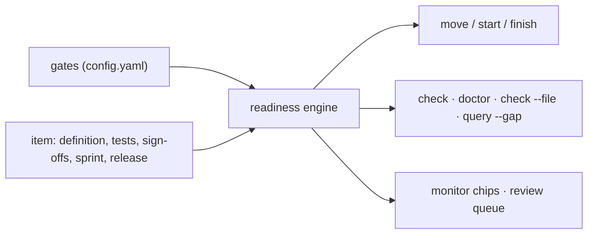

# Architecture overview

## Goals & principles

- **YAML/markdown files only** — no database; human-readable and version-controllable.
- **The CLI is the single writer** — it edits the local data folder **directly** (store +
  `dispatch` + git). There is no server in the write path, no login, no accounts.
- **The view is a read-only, localhost monitor** — `kanbanr serve` serves the read API + live SSE +
  the SPA over the same folder. No auth (expose beyond localhost only behind a reverse proxy). The
  viewer is pluggable (today a React SPA; a VS Code extension is on the roadmap).
- **Git is the sharing/centralization boundary** — the data folder is a git repo; every write is a
  commit by the configured identity (`kanbanr identity`); optional remotes are pulled + pushed
  after each commit. **Merge conflicts are left for normal git resolution** — kanbanr never
  auto-resolves.
- **One runtime, no Docker required** — a single `kanbanr` binary is both the writer and (via
  `kanbanr serve`) the view daemon. Docker is just one optional packaging.
- **On-disk layout mirrors the board** — feature items live in a folder named after their status.
- **Multi-project** — one data dir with a folder per project.

## Components

`kanbanr-core` is the engine (models, store, validation, git, the activity changelog, and a
`dispatch` router that maps `(method, path, body)` onto store calls — the single source of truth
for data operations). The **CLI** links it to write the folder directly; the **view daemon**
(`kanbanr-server`, a library run by `kanbanr serve`) links it to read. Both go through `dispatch`,
so they agree by construction. It's all one binary.

## Runtime: one writer, a read-only view, git

- **No accounts, no JWT.** The writer is you on your machine; the view is a localhost read-only
  window onto your files. **Access control for sharing is the git remote's job** (e.g. GitHub
  decides who can pull/push the data repo).
- **Identity** for commits comes from the data repo's git config (`kanbanr identity --name --email`),
  else the user's own git identity, the same in every write — the first commit included. With
  neither, kanbanr refuses the write rather than commit as a placeholder.
- **Git** uses `git2`/libgit2, statically linked — no external `git` binary. Sync is best-effort and
  never blocks a write; a conflict aborts the merge cleanly and is resolved with normal git in the
  folder.
- **Exposure.** `kanbanr serve` binds `127.0.0.1` by default and has no TLS/auth by design. To
  reach it from another machine, leave the bind alone and put it behind a reverse proxy that
  terminates TLS and adds auth (Caddy/nginx examples in
  [the monitor chapter](../using/the-monitor.md#exposing-the-monitor-beyond-localhost)).

## The rules: one engine for what is missing

Whether an item may move, what `kanbanr check` reports, what `doctor` warns about, what
`check --file` holds a pull request to, what `query --gap` finds and what the monitor's chips say
are all **one question**: what does this item lack against a list of conditions? `readiness.rs`
answers it, once, for every surface — they used to carry five copies of the rule, and the copies had
drifted apart.

- **Checks are a closed vocabulary** kanbanr can evaluate from the board alone: `definition`,
  `statement`, `goals`, `zachman` (optionally named dimensions), `requirements`, `ears`,
  `tests_named`, `tests_green`, `approved`, `estimated`, `in_sprint`, `in_release`, and named
  sign-offs. No process semantics are hard-coded and no user code runs (ADR-0010).
- **Gates** (`config.yaml` → `gates`) say which checks a stage asks of an item entering it, whether
  a gap blocks or only warns, which sign-offs it needs, whether it makes the branch, and whether
  reaching it counts as done for the sprint. A board with no gates gets the old rule synthesised —
  approval to start, the readiness list to finish — so it behaves exactly as before, and is stamped
  schema 3 only once it declares any, so an older binary refuses it instead of ignoring its gates.
- **Agreement is pinned to content.** An approval or a sign-off records the definition's revision;
  editing the definition lapses it. A move made past a gate with `--override` records why, and
  `ratify` agrees to it afterwards.

## Cadence: sprints, releases and the burndown

Sprints and releases are **off unless a project switches them on** (`config cadence`). Sprints live
in `sprints.yaml` and releases in `releases.yaml`, beside the project; an item records the sprint and
release it is planned into. Nothing about progress is stored: the **burndown** is derived from the
moves items recorded — each day's remaining is the sprint's scope less what had reached a stage
counting as done (an end status, or one whose gate says `done`, like Scrum's Done) — and velocity
from the sprints that closed. `release cut` ships what is finished, writes the notes as a board
document, and carries the rest to the next release, recording that it did.

