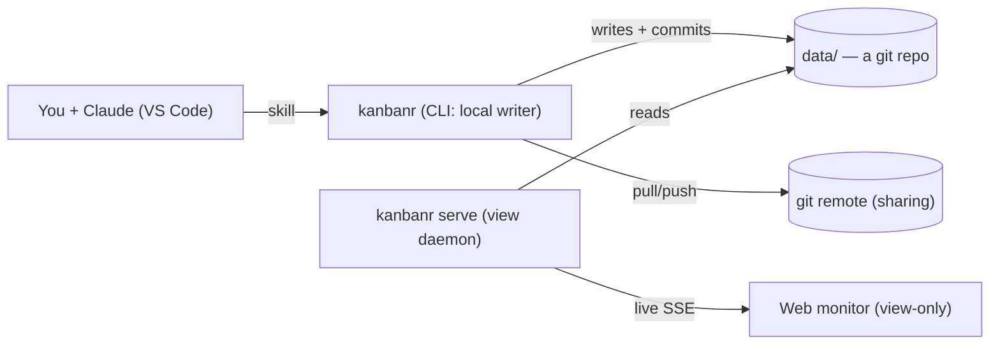

# How the pieces fit

## How the pieces fit

You talk to Claude → Claude runs `kanbanr` commands → the CLI writes the files and commits to git
→ `kanbanr serve` (if running) pushes the change to the monitor live.
