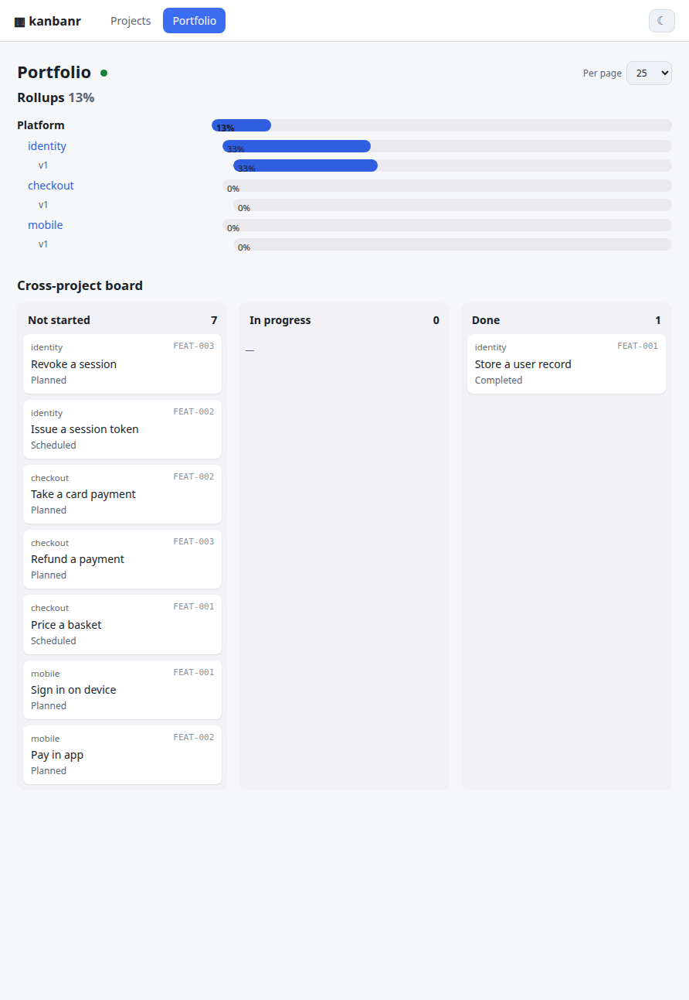

# Portfolio: work across several projects

A portfolio view answers one question a single project cannot: **what is this project waiting on
that it does not own?**

Inside one board, `kanbanr blocked` tells you which items are waiting on other items. Across
several, the dependency that matters is usually the one you cannot see from where you are standing
— a shared service two products rest on, scheduled by a team that does not know they are in the
critical path.

## A worked example you can run

kanbanr's own board is a single project, so nothing in this repository demonstrates any of it.
There is a script that builds one:

```bash
tools/demo/portfolio.sh              # writes to a temp folder; never touches your board
```

It creates three projects under one program — a shared `identity` service, a `checkout` product and
a `mobile` product — with dependencies that genuinely cross project boundaries:

```text
identity:FEAT-002  Issue a session token
  ├── checkout:FEAT-002  Take a card payment      (cannot charge who you cannot identify)
  │     └── mobile:FEAT-002  Pay in app
  └── mobile:FEAT-001    Sign in on device
```

A dependency is written as `project:CODE`; a bare `CODE` means the current project.

```bash
kanbanr feature add --title "Take a card payment" --milestone MS-001 \
    --depends-on "identity:FEAT-002"
```

## What it answers

```console
$ kanbanr --project identity impact FEAT-002
checkout:FEAT-002
checkout:FEAT-003
mobile:FEAT-001
mobile:FEAT-002
```

Four items in **two other projects** move if that one slips — the fact nobody in `identity` would
otherwise have.

```console
$ kanbanr --project mobile blocked
mobile:FEAT-001
mobile:FEAT-002
```

Both of `mobile`'s items are waiting on work it does not own.

```console
$ kanbanr portfolio rollups
Portfolio — 13% (0/0 tasks)
  Platform — 13%
    identity — 33%
    checkout — 0%
    mobile — 0%
```

Progress rolls up milestone → project → program → portfolio, derived from task state every time it
is asked — never stored, so it cannot disagree with the boards it is computed from.

## In the monitor

<p align="center"></p>

The **cross-project board** puts every project's work into one set of normalised lanes, with the
project named on each card. Lanes are normalised because projects need not share a workflow: one
may have `Scheduled`, another `In Progress`, and the portfolio maps both onto the same three
columns rather than inventing a common vocabulary the projects never agreed to.

## Declaring a program

Projects in a data folder are neighbours; a **program** is the statement that they belong together.

```bash
kanbanr portfolio add-program platform --name "Platform" \
    --projects identity,checkout,mobile
```

That writes `workspace.yaml` beside the projects. Without it the portfolio still lists every
project, but nothing groups them and the rollup has only one level.

## The limit worth knowing

Everything here works within **one data folder**, which is also the sharing and access boundary
(`ADR-0007`). A portfolio spanning boards that different people can see is a different problem —
it needs per-project access with a view across them, which git remotes alone do not give. That is
recorded as `FEAT-074`, deliberately deferred, with the triggers to revisit it written down rather
than left as an assumption.
