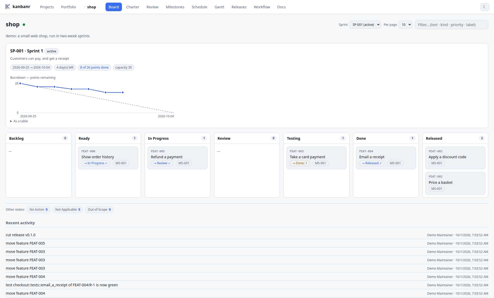
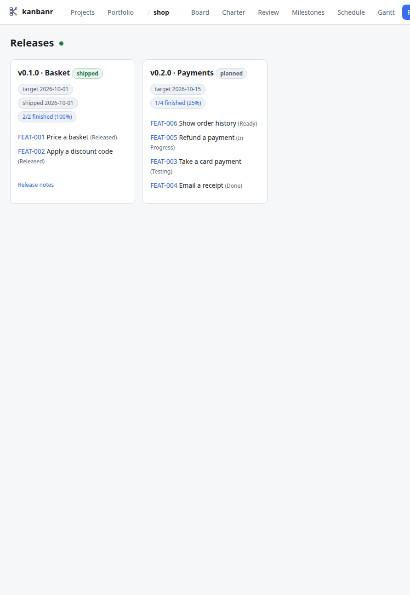
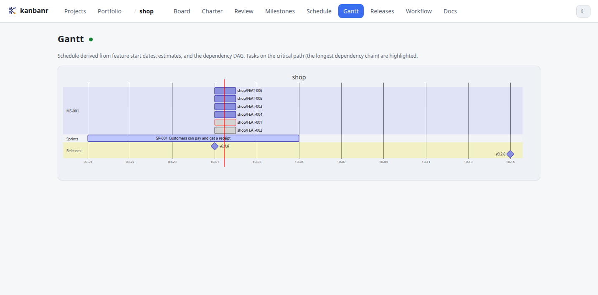

# Processes: presets, gates and sign-offs

A project's workflow is its **process**: the statuses work moves through, which moves are
allowed, and what each status asks of an item before the item may enter it. kanbanr knows how to
check things. The project decides which checks apply where. None of it is hard-coded: TOGAF, PDCA,
a design-control flow or your organisation's own process is a file.

In Claude Code you never read this table to know what to do next: Claude asks the board what the
next stage needs and turns each gap into a draft or a question — see
[Working with Claude](with-claude.md).

## Choosing a process

```bash
kanbanr config workflow --preset list          # what each preset is
kanbanr config workflow --preset togaf         # apply one (statuses, transitions and gates)
kanbanr config workflow --export > ours.yaml   # this project's workflow, as a file
kanbanr config workflow --from-file ours.yaml  # load your own
kanbanr project init shop --workflow pdca      # choose at creation
```

| Preset | Stages | Gates |
|---|---|---|
| `default` | Planned → In Progress → Completed, plus Deferred and Ongoing | none declared: the built-in rule |
| `scheduled` | Planned → Scheduled → Completed | none declared: the built-in rule |
| `togaf` | Vision → Business Arch → System Design → Implementation → Migration → Operations | the definition grows phase by phase |
| `pdca` | Plan → Do → Check → Act | agreement to start, evidence to check, a review sign-off to act |
| `design-control` | Planning → Inputs → Design → Review → Verification → Validation → Released | sign-offs at review and validation |
| `scrum` | Backlog → Ready → In Progress → Review → Testing → Done → Released | Definition of Ready and of Done; work starts in the sprint; sprints, releases and points on |
| `agile` | Plan → Design → Develop → Test → Review → Released | agreement before build, evidence before review; sprints and releases on |

`design-control` is **modelled on** the design-and-development controls of ISO 9001 clause 8.3.
That is not a claim of compliance: only a certification body can make that.

A preset is copied into the project when you choose it. From then on the project's own
`config.yaml` is what counts, and editing it never changes the preset. New projects get
`default`. Existing boards keep whatever workflow they have.

**The built-in rule.** A workflow that declares no gates still has one: moving an item into a
status that means work has started needs an approved definition. That is a status the board
displays, that is not where items start, and that is neither an end state nor a no-op. `start`
makes the branch at the first such status. And finishing an item's last task completes it only when
each of its requirements has a green test — what `kanbanr finish` asks — otherwise the item stays,
and the task write says which requirements are unproven.

## Gates

A gate is the entry criteria of one status:

```yaml
gates:
  System Design:
    purpose: How and where it will be built, and the quality it must reach.
    requires: [{zachman: [how, where]}, approved]
    warns: [quality]
  Implementation:
    purpose: Build it, with a test named for every requirement.
    requires: [tests_named, approved]
    on_enter: [branch]
  Operations:
    requires: [tests_green]
    signoffs: [release]
```

| Field | Meaning |
|---|---|
| `purpose` | What the stage is for. `kanbanr check`, the monitor and CLAUDE.md show it, so the definition is written one stage at a time. |
| `requires` | Checks that must pass to enter. |
| `warns` | Checks that are reported, never enforced. |
| `signoffs` | Named sign-offs that must be recorded against the current definition. |
| `enforce` | `block` (the default) refuses the move; `warn` allows it and reports what is missing. |
| `kinds` | Apply only to items of these kinds; an item with no kind is a `feature`. |
| `on_enter` | `branch`: `kanbanr start` makes the item's branch here, where the project is a git repository. |
| `done` | `true`: reaching this stage finishes an item for the sprint burndown, the sprint's done total and what a closing sprint carries over. Without it only the end statuses count. The `scrum` preset marks **Done**, its Definition of Done, so a sprint burns down as items are done rather than all at once when a release ships them. |

### The checks

The vocabulary is closed on purpose: a gate can only ask for what kanbanr can judge from the
board.

| Check | Passes when |
|---|---|
| `definition` | the item has a definition at all |
| `statement` | the one-sentence statement is written |
| `goals` | it links at least one charter goal |
| `zachman` | all six dimensions are answered; `{zachman: [what, why]}` asks for only those |
| `requirements` | it has at least one requirement |
| `ears` | every requirement is in EARS form |
| `tests_named` | every requirement names a test |
| `tests_green` | every requirement has a green test |
| `quality` | quality requirements carry an ISO 25010 tag and a measured scenario that names its test |
| `approved` | the definition is agreed: approved, or ratified after the fact |
| `bypass` | a recorded override has been answered |
| `goals_known` | every linked goal exists in the charter |
| `small` | not estimated above three days |
| `estimated` | estimated in the project's unit: story points or days (`kanbanr config cadence --unit points`) |
| `in_sprint` | planned into the active sprint (projects with sprints switched on) |
| `in_release` | planned into a release (projects with releases switched on) |

An unknown check, an unknown status or an unknown Zachman column is refused when the workflow is
saved. A gate that could never match is a guardrail that silently isn't there.

### When a gate isn't met

- **A blocking gate** refuses the move and lists everything missing.
- **`--override "<reason>"`** gets past a blocking gate, and the reason is kept in the item's
  history. It also records the item as started without agreement, so it shows on the Review page
  until someone ratifies it. `--unapproved` is the older name.
- **Finishing the last task** moves the item to its end status only if that status's gate is
  met — and, on a workflow with no gates, only if every requirement has a green test. Otherwise
  it stays, and `kanbanr task state` says why. A batch is judged after its last operation, so one
  that ticks the last task and then adds another never completes the item.

## Sign-offs

Some conditions are invisible in board data: a design review was held, a release was approved.
A **sign-off** records one:

```bash
kanbanr signoff FEAT-042 design-review --note "held 30 Sep" --doc reviews/checkout.md
```

- **What it records:** who gave it, when, in which status, and the definition it covered.
- **When it lapses:** changing the definition lapses it, just as it lapses an approval. A review
  of a different design is not a review of this one. Earlier sign-offs are kept.
- **Where it can be given:** a gate asks for it by name (`signoffs: [design-review]`). The Review
  page offers a **Sign off** button for each one a next stage is waiting on.
- **Who gives it:** a sign-off is a person's agreement. Claude asks for it and never gives it.

## Growing a definition stage by stage

Under a phased process, an item doesn't need its whole definition at once. `kanbanr check` says
what the next stage needs:

```text
✗ FEAT-001 Checkout
    [MISSING: Who]
    …
    → to move to Business Arch (Who it is for, what it must do, and why), still needed:
        no goal link — nothing says what this is for
        [MISSING: Who]
        no requirements — nothing states what must be true for this to be done
```

`doctor` follows the same rule on a workflow with gates: it reports what the next stage asks, not
what a later stage will. Each time the definition grows, its approval lapses and is given again.
Each approval records the status it was given in, so the history reads "approved at Business
Arch, again at System Design".

## A worked example: PDCA

```bash
kanbanr config workflow --preset pdca
kanbanr feature add --title "Cut checkout errors" --milestone MS-001    # lands in Plan
kanbanr check FEAT-001                  # Do asks: statement, goals, requirements, tests named, approval
kanbanr feature define FEAT-001 --file cut-errors.yaml
kanbanr approve FEAT-001                # the user agrees to the plan
kanbanr start FEAT-001                  # Do: branch made here
# … make the change; tests go green …
kanbanr move FEAT-001 Check             # Check asks: tests green
kanbanr signoff FEAT-001 review         # the user records the review
kanbanr finish FEAT-001                 # Act: the end status, gated by the review sign-off
```

## Sprints and releases

Sprints, releases and burn-rate reports are **off unless a project switches them on**. The `scrum`
and `agile` presets do this, and any other project can too:

```bash
kanbanr config cadence --sprints on --releases on --unit points --sprint-length 14
kanbanr sprint add --start 2026-10-05 --goal "Shoppers can pay" --capacity 20
kanbanr sprint plan SP-001 FEAT-001 FEAT-002    # warns when it goes over capacity
kanbanr sprint start SP-001
kanbanr sprint list                             # every sprint and its state
kanbanr sprint show                             # goal, days left, committed vs done, burndown
kanbanr sprint close SP-001 --carry-to SP-002   # unfinished work moves on, and is recorded
kanbanr retro --sprint SP-001

kanbanr release add v0.1.0 --target 2026-10-18
kanbanr release plan v0.1.0 FEAT-001 FEAT-002
kanbanr release list                            # every release, planned or shipped
kanbanr release cut v0.1.0 --tag                # ship what is finished, write notes, carry the rest
kanbanr feature add --title "…" --milestone MS-001 --found-in v0.1.0   # feedback on a release
```

The burndown and velocity are derived from the moves items record; nothing is stored for them. An
item counts as finished from the day it first reaches a stage marked `done` — Done, in `scrum` — or
an end status.

On the board, a project that uses sprints opens on the running one — its goal, dates, days left,
committed against done, and the burndown against the ideal line:



The Releases page shows each release's scope, how much of it is finished, its target, and its notes
once cut; the Gantt adds the sprints as a lane and the releases as milestones:




`kanbanr config workflow --write-agreement` writes the team's working agreement to the board,
generated from the gates. Under Scrum that is the Definition of Ready and of Done. Because it is
generated, it can't drift from what is enforced.

## Writing your own process

Start from the closest preset and edit it:

```bash
kanbanr config workflow --preset design-control
kanbanr config workflow --export > our-process.yaml
# edit our-process.yaml: rename stages, move sign-offs, add `kinds:` to gates
kanbanr config workflow --from-file our-process.yaml
```

The file holds statuses, `default_state`, `displayed_states`, `no_op_states`, `terminal_states`,
`transitions` and `gates`. It has no name, so one process file can serve many projects. A board
that declares gates is stamped `schema_version: 3`, so an older kanbanr refuses to open it instead
of ignoring its gates.
