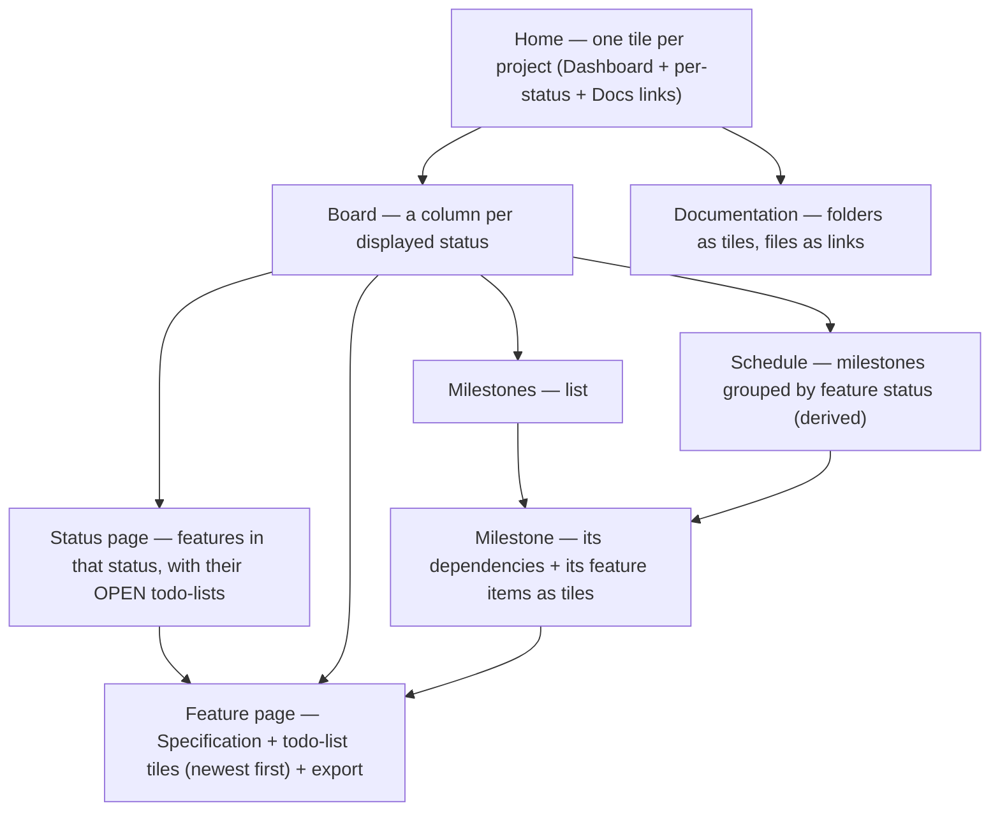

# Sharing and the live monitor

## Sharing & the live monitor

**Sharing/centralization is the git remote's job** — whoever can pull/push the data repo is in:

```bash
kanbanr remote add origin git@host:org/data.git    # pulled + pushed after each commit
```

### Conflicts & not losing data

kanbanr is safe by construction: **every change is committed to your local data repo *before* any
remote sync**, so a remote problem can never lose your work. If a push can't go through (the remote
moved on, or a real merge conflict), kanbanr **does not auto-resolve** — it prints a warning with
the exact commands and leaves it to you:

```
kanbanr: remote 'origin': could not push (…). Your change is committed locally, so nothing is
lost. To sync, resolve in the data folder with normal git:
    git -C <data-dir> pull --no-rebase origin <branch>
    git -C <data-dir> push origin <branch>
```

Because the data folder is a **plain git repository**, you resolve exactly as you always do —
`git pull`, fix conflicts (e.g. `git mergetool`), commit the merge, `git push`. Then keep using
`kanbanr` normally. (Tip: for shared data, treat it like code — pull before a work session.)

**The monitor** is a separate, read-only view of your local folder — localhost, no login:

```bash
kanbanr serve                       # built into the binary: no --ui-dir, no Node
kanbanr open                        # opens http://localhost:8080 — just the board
```

Expose it beyond localhost only behind a reverse proxy you control.

### Exposing the monitor beyond localhost

`kanbanr serve` binds `127.0.0.1` and has **no auth or TLS by design** — it's a local, read-only
window onto your own files. To reach it from another machine, **don't change the bind**; instead put
a **reverse proxy** in front that terminates **TLS** and adds **authentication**, proxying to the
unchanged `127.0.0.1:8080`. (kanbanr deliberately ships none of this — sharing is otherwise the git
remote's job; see [DESIGN.md](DESIGN.md) §3.) Two minimal working examples:

**Caddy** (automatic HTTPS + basic auth) — `Caddyfile`:

```caddy
board.example.com {
    basic_auth {
        # generate the hash with: caddy hash-password
        you $2a$14$REPLACE_WITH_BCRYPT_HASH
    }
    reverse_proxy 127.0.0.1:8080
}
```

**nginx** (TLS + basic auth) — server block:

```nginx
# create the password file: htpasswd -c /etc/nginx/.htpasswd you
server {
    listen 443 ssl;
    server_name board.example.com;

    ssl_certificate     /etc/ssl/certs/board.example.com.crt;
    ssl_certificate_key /etc/ssl/private/board.example.com.key;

    location / {
        auth_basic           "kanbanr monitor";
        auth_basic_user_file /etc/nginx/.htpasswd;

        proxy_pass http://127.0.0.1:8080;
        proxy_http_version 1.1;
        # SSE: stream live updates without buffering or timing out
        proxy_set_header Connection "";
        proxy_buffering off;
        proxy_read_timeout 1h;
    }
}
```

The proxy enforces who gets in and encrypts the connection; kanbanr behind it stays read-only, so an
authenticated viewer still can't mutate your board — writes only ever happen through the local CLI.

### Mirroring to GitHub issues

If collaborators follow your GitHub issues, kanbanr can keep issues in step with the board using
the GitHub CLI (`gh`). It works **one way**: kanbanr is the source of truth, and issues follow it.

```bash
gh auth login                                  # once
kanbanr mirror enable --repo acme/shop         # public repos also need --allow-public
kanbanr mirror sync --all                      # optional: issues for existing open features
```

After that, every kanbanr change updates GitHub:

| In kanbanr | On GitHub |
|---|---|
| New feature | New issue (title, spec, todo-lists as checklists, labels) |
| Title / spec / labels / tasks change | Issue updated |
| Moved to Completed | Issue closed as completed |
| Moved to a no-op state (e.g. Out-of-Scope) | Issue closed as not planned |

- Only features whose issue would actually change call GitHub. If GitHub can't be reached, the
  change is still saved in kanbanr and a warning is printed; `kanbanr mirror sync` catches up.
  `KANBANR_MIRROR=off` pauses the automatic sync for a session.
- Features imported from GitHub issues stay linked to them, so nothing is duplicated.
  `kanbanr mirror link FEAT-012 45` links an existing issue by hand; its content is replaced by
  kanbanr's on the next sync.
- Edits and comments made on GitHub aren't pulled back automatically. `kanbanr mirror pull FEAT-012`
  shows whether the issue was edited since the last sync, its current content, and new comments,
  so you (or Claude) can bring what matters into kanbanr first.
- `kanbanr mirror status` shows what a sync would do without calling GitHub;
  `kanbanr mirror disable` turns the mirror off and keeps the links.

The mirror refuses a public repository unless you pass `--allow-public`, because specs, task lists
and notes become visible to anyone.


## The monitor (read-only) — navigation



- **Home tile**: project name + description, an **Open dashboard** link, a link per **status**
  (with counts), and a **Documentation** link.
- **Board**: one column per state in `displayed_states`; click a card → that feature's page.
- **Status page**: features in one status, grouped by feature, each showing only its **open**
  todo-lists (those not fully completed), newest first, with their tasks.
- **Feature page** (an *epic*): the **Specification** (rendered markdown) and a **tile per
  todo-list** (newest first), each tile holding that list's tasks, plus markdown/JSON export.
  Add a new todo-list per work session — they persist, so multi-session work is never lost.
- **Milestone page**: the milestones it **depends on**, plus its **feature items as tiles**.
- **Schedule**: a *derived* view — for each displayed status, the milestones that contain
  feature items in that status, dependency-ordered. Nothing to create; it always reflects reality.
- **Documentation**: drill from root folders (tiles) into sub-folders and files (any depth);
  files render as markdown.

Everything is **view-only** and refreshes live (a green dot shows the live connection). A
**light/dark theme toggle** sits in the top bar (it remembers your choice and follows your OS
preference by default), and the layout is **responsive** (usable on a phone) with keyboard-focus and
reduced-motion accessibility niceties.
