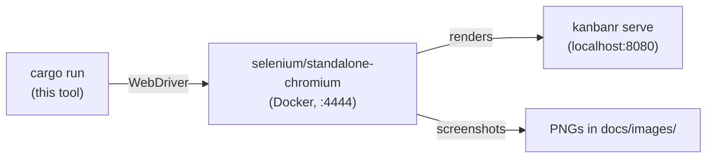

# kanbanr screenshot tool

Regenerates the documentation screenshots in [`../../docs/images/`](../../docs/images/) by driving a
real browser over the live web monitor — using **Selenium Grid in Docker** + a small **Rust
WebDriver** client ([`thirtyfour`](https://crates.io/crates/thirtyfour)).



## Prerequisites

- **Docker** (pulls `selenium/standalone-chromium`, ~1GB the first time).
- A **running monitor** with representative data: `kanbanr serve --ui-dir web/dist` on
  `http://localhost:8080`. If it isn't running, `capture.sh` builds and starts a temporary one from
  the repo's `data/` folder automatically.
- A Rust toolchain (this is a standalone crate — it does **not** build with the main `api/`
  workspace, so it won't slow normal builds).

## Run it

```bash
make screenshots                 # from the repo root — orchestrates everything
# or directly:
tools/screenshots/capture.sh
```

`capture.sh` starts the Selenium container (host network), waits for the grid, runs the tool, writes
the PNGs, then removes the container.

### Manual / debugging

```bash
docker compose -f tools/screenshots/docker-compose.yml up -d   # start the grid
cd tools/screenshots && cargo run                              # capture (uses the env vars below)
docker compose -f tools/screenshots/docker-compose.yml down    # stop the grid
```

## Configuration (env vars)

| Var | Default | Meaning |
|---|---|---|
| `SELENIUM_URL` | `http://localhost:4444` | WebDriver endpoint of the grid |
| `KANBANR_URL` | `http://localhost:8080` | base URL of the running monitor |
| `KANBANR_PROJECT` | `kanbanr` | project slug to screenshot |
| `KANBANR_FEATURE` | `FEAT-001` | feature code for the feature-detail page |
| `OUT_DIR` | `docs/images` | output directory for the PNGs |

## Output

Light-theme, fixed portrait "15-inch laptop (vertically twisted)" frames for the non-dashboard
pages, the board at full content height, and two dark-theme showcases:

`home.png`, `status.png`, `ongoing.png`, `feature.png`, `milestones.png`, `milestone.png`,
`schedule.png`, `docs.png`, `board.png`, plus `board-dark.png` and `feature-dark.png` (dark theme).
Referenced from the top-level [`README.md`](../../README.md).

Tweak the framing with env vars (`FRAME_W`/`FRAME_H` for the portrait pages, `BOARD_W` for the
board) — see the table above and the header comment in `src/main.rs`.

## Keep the grid running between runs

The Selenium container is **left running** after a capture so repeated runs are fast (they reuse
it). Stop it when you're done:

```bash
tools/screenshots/capture.sh --down
```
